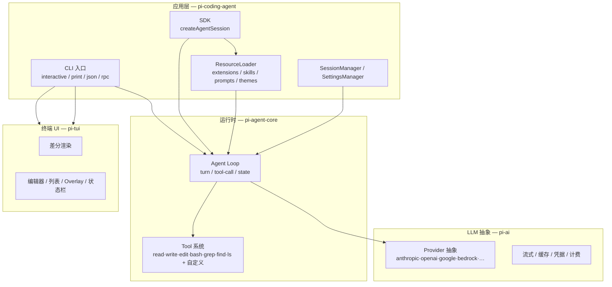
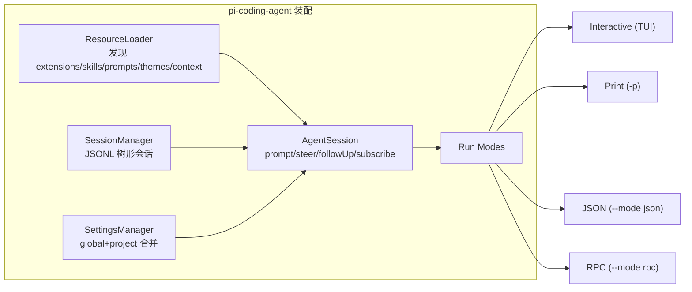
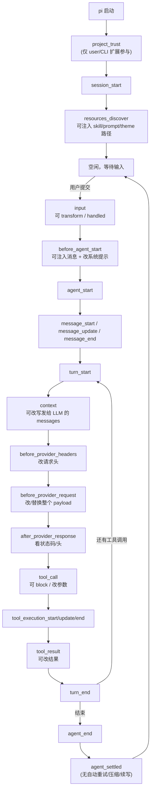
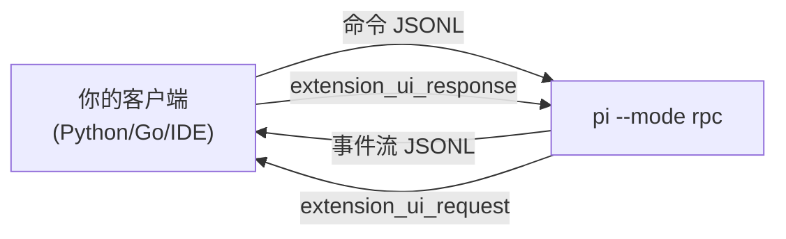
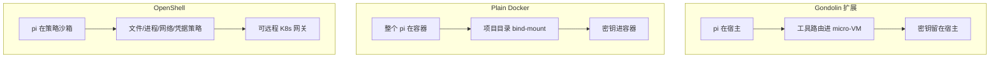

# Pi Agent 高阶使用指南：四组件协同与工具链集成

> 上一篇《Pi-Agent-Windows-使用指南.md》解决「装好、配上火山引擎模型、能对话」。
> 本篇解决「把 Pi 当成一个可编程的 Agent 平台来用」：理解四个官方组件如何分层协同，并通过 Extensions / SDK / RPC 三条路线把 Pi 嵌入你现有的工具链（Git、tmux、Docker、SSH、CI、IDE、Slack……）。
>
> 官方仓库：<https://github.com/earendil-works/pi> ｜ 文档：<https://pi.dev/docs/latest>

---

## 目录

- [一、四组件架构总览](#一四组件架构总览)
- [二、四组件详解与协同](#二四组件详解与协同)
- [三、Extensions：在进程内重塑 Pi](#三extensions在进程内重塑-pi)
- [四、SDK：把 Pi 嵌入你自己的应用](#四sdk把-pi-嵌入你自己的应用)
- [五、RPC 模式：跨语言 / IDE / 子进程集成](#五rpc-模式跨语言--ide--子进程集成)
- [六、安全与沙箱](#六安全与沙箱)
- [七、实战配方：配合其他工具](#七实战配方配合其他工具)
- [八、高阶配置技巧](#八高阶配置技巧)
- [附录 A：扩展开发速查表](#附录-a扩展开发速查表)
- [附录 B：官方资源与参考](#附录-b官方资源与参考)

---

## 一、四组件架构总览

Pi 官方仓库（`earendil-works/pi`）是一个 monorepo，由四个分层包组成。**每个上层包都构建在下层之上**，你可以按需取用到任意一层：

| 包 | 角色 | 你会用到它当…… |
|----|------|----------------|
| **`@earendil-works/pi-ai`** | 统一 LLM API | 你只要一个「多 Provider、带流式/缓存/凭据管理」的 LLM 客户端，不需要 agent loop |
| **`@earendil-works/pi-agent-core`** | Agent 运行时 | 你要自己写 agent 循环、工具调用、消息状态机，但 UI 自己做 |
| **`@earendil-works/pi-tui`** | 终端 UI 库 | 你要做差分渲染的终端组件（编辑器、列表、overlay），与 agent 无关 |
| **`@earendil-works/pi-coding-agent`** | 编码智能体 CLI | 你要一个开箱即用的编码 agent，并享受上面三层的全部能力 |

另外有姊妹项目 **`earendil-works/pi-chat`**，用于 Slack / 聊天自动化与工作流。



**关键认知**：`pi` 命令行只是 `pi-coding-agent` 的一种装配方式。通过 SDK，你可以用同样的 `AgentSession` 跑在 Web 后端、CI runner、IDE 插件里；通过 RPC，你甚至能用 Python/Go 驱动它。

---

## 二、四组件详解与协同

### 2.1 pi-ai — 统一 LLM API

最底层。把 Anthropic / OpenAI / Google / Bedrock / Mistral / DeepSeek / Kimi / 火山（自定义）……抽象成统一的 `Provider` + `Model` + 流式事件。

你直接用它（不需要 agent）的场景：

```typescript
import { getModel, streamMessage } from "@earendil-works/pi-ai";

const model = getModel("anthropic", "claude-sonnet-4-5")!;
for await (const ev of streamMessage(model, { messages: [...] })) {
  if (ev.type === "text_delta") process.stdout.write(ev.delta);
}
```

它替你处理了：多 Provider 协议差异、SSE/WebSocket 传输、prompt cache、API Key/OAuth 凭据存储、计费统计、context overflow 检测。**你上一篇配的火山引擎 `models.json`，最终就是被 pi-ai 的 `ModelRuntime` 加载的。**

### 2.2 pi-agent-core — Agent 运行时

在 pi-ai 之上实现 **agent loop**：一次「LLM 响应 → 工具调用 → 工具结果 → 再请求 LLM」的循环，加上消息历史、系统提示、思考等级、重试、压缩。

核心抽象是 `Agent` + `AgentState`：

```typescript
state.messages    // AgentMessage[]，会话历史（树形）
state.model       // 当前模型
state.tools       // AgentTool[]
state.thinkingLevel
state.streamingMessage  // 当前流式输出
```

Pi 的「无 sub-agent / 无 plan mode / 无 permission」哲学就是：**pi-agent-core 只给你 loop 和工具机制，上层策略你自己定**（用 Extension 或 SDK 实现）。

### 2.3 pi-tui — 终端 UI 库

独立的差分渲染终端组件库。`pi` 的编辑器、`/tree` 树视图、overlay、状态栏、图片显示都基于它。你也可以单独用它做任意 TUI 应用。在 Extension 里通过 `ctx.ui.custom()` 可以把自己的 pi-tui 组件嵌进 Pi 界面。

### 2.4 pi-coding-agent — 顶层装配

把上面三者 + 资源加载 + 会话管理 + 四种运行模式组装成成品：



四种模式共享同一个 `AgentSession`，所以你在 TUI 里写的扩展，在 RPC/SDK 里也能用——这是 Pi 集成能力的根基。

---

## 三、Extensions：在进程内重塑 Pi

Extension 是一个 TypeScript 模块，Pi 用 jiti 加载（无需编译）。它通过 **事件总线 + 注册 API** 改变 Pi 的行为。这是最高频的高阶玩法。

### 3.1 事件生命周期（最重要的图）

理解这张图，你就知道在哪个钩子做什么事：



**几个高价值钩子**：

| 钩子 | 典型用途 |
|------|----------|
| `before_agent_start` | 按项目/分支注入额外指令、动态改系统提示 |
| `context` | 删除老消息、注入检索结果（RAG）、脱敏 |
| `before_provider_request` | 审计/重写发往 LLM 的 payload，调试缓存 |
| `tool_call` | 危险命令拦截、参数改写（如给 bash 加 `source ~/.profile`） |
| `tool_result` | 对工具输出二次加工（如调另一个模型摘要） |
| `user_bash` | 接管 `!` / `!!` 用户命令（如 SSH 远程执行） |
| `session_before_compact` | 自定义压缩策略 |
| `message_end` | 改写 finalized 消息（如归一化 overflow 错误） |

### 3.2 Extension 能注册什么

```typescript
export default function (pi: ExtensionAPI) {
  pi.registerTool({...})        // LLM 可调用的工具
  pi.registerCommand("x", {...})// /x 斜杠命令
  pi.registerShortcut("ctrl+x",{...})
  pi.registerFlag("my-flag",{...})   // --my-flag 自定义 CLI 参数
  pi.registerProvider("id", {...})   // 自定义 Provider / 代理
  pi.on("event", handler)            // 事件订阅
}
```

工厂函数可以是 `async`，Pi 会等它完成才继续启动——适合在启动时拉取远程模型列表再 `registerProvider`。

### 3.3 一个最小扩展：危险命令拦截 + 自定义工具

```typescript
// ~/.pi/agent/extensions/safe-greet.ts
import { Type } from "typebox";
import type { ExtensionAPI } from "@earendil-works/pi-coding-agent";

export default function (pi: ExtensionAPI) {
  // 拦截 rm -rf
  pi.on("tool_call", async (event, ctx) => {
    if (event.toolName === "bash" && event.input.command?.includes("rm -rf")) {
      const ok = await ctx.ui.confirm("危险", "允许执行 rm -rf?");
      if (!ok) return { block: true, reason: "用户拒绝" };
    }
  });

  // 注册一个 LLM 可调用的工具
  pi.registerTool({
    name: "deploy",
    label: "Deploy",
    description: "触发部署流水线",
    parameters: Type.Object({ env: Type.String() }),
    async execute(_id, params, _signal, _onUpdate, ctx) {
      ctx.ui.notify(`部署到 ${params.env}`, "info");
      return { content: [{ type: "text", text: `deployed to ${params.env}` }], details: {} };
    },
  });

  // 注册一个 /deploy 斜杠命令
  pi.registerCommand("deploy", {
    description: "一键部署",
    handler: async (args, ctx) => ctx.ui.notify(`部署: ${args}`, "info"),
  });
}
```

放进 `~/.pi/agent/extensions/` 后，`/reload` 即时生效，无需重启。

### 3.4 自定义 UI

扩展可以渲染：编辑器上/下方的 widget、状态栏、页脚、标题栏、overlay，甚至用 `ctx.ui.custom()` 替换整个编辑器。自带示例里有 Doom、贪吃蛇、井字棋、太空入侵者——证明 UI 层是完全开放的。

```typescript
pi.on("turn_start", (_e, ctx) => {
  ctx.ui.setStatus("turn", `第 ${turn} 轮`);
  ctx.ui.setWidget("progress", ["进度:", "▓▓▓░░ 60%"], "aboveEditor");
});
```

### 3.5 自定义 Provider / 代理

两种方式：

1. **`models.json`**（声明式）：适合 OpenAI/Anthropic 兼容端点，如你已配的火山引擎。
2. **Extension 里 `pi.registerProvider()`**（编程式）：适合需要 OAuth、动态模型发现、自定义流式协议的场景。自带示例 `custom-provider-anthropic/`、`custom-provider-gitlab-duo/`。

### 3.6 自带示例索引（70+ 个，挑常用的）

| 示例 | 作用 |
|------|------|
| `subagent/` | 委派给独立 pi 子进程，隔离上下文，支持并行/链式 |
| `plan-mode/` | 只读探索→生成计划→执行，bash 白名单 |
| `ssh.ts` | 把 read/write/edit/bash 路由到远程机器 |
| `git-checkpoint.ts` | 每轮 git stash 建检查点，fork 时可回滚代码 |
| `permission-gate.ts` / `confirm-destructive.ts` | 危险操作确认 |
| `protected-paths.ts` | 禁止写 `.env`/`node_modules` 等 |
| `auto-commit-on-exit.ts` | 退出时自动提交 |
| `custom-compaction.ts` / `summarize.ts` | 自定义压缩/摘要 |
| `gondolin/` | 工具路由进 Linux micro-VM |
| `sandbox/` | 沙箱执行 |
| `dynamic-tools.ts` | 运行时动态增删工具 |
| `todo.ts` | TODO 列表（Pi 官方不内置） |
| `status-line.ts` / `custom-footer.ts` / `custom-header.ts` | UI 定制 |
| `github-issue-autocomplete.ts` | `@` 补全 GitHub issue |
| `interactive-shell.ts` | 长驻交互式 shell |
| `doom-overlay/` / `snake.ts` / `space-invaders.ts` | 证明 UI 开放度 |

---

## 四、SDK：把 Pi 嵌入你自己的应用

SDK 在 `@earendil-works/pi-coding-agent` 主包里，无需另装。核心是 `createAgentSession()`。

### 4.1 最小可用

```typescript
import { createAgentSession, ModelRuntime, SessionManager } from "@earendil-works/pi-coding-agent";

const modelRuntime = await ModelRuntime.create();
const { session } = await createAgentSession({
  sessionManager: SessionManager.inMemory(),
  modelRuntime,
});

session.subscribe((ev) => {
  if (ev.type === "message_update" && ev.assistantMessageEvent.type === "text_delta") {
    process.stdout.write(ev.assistantMessageEvent.delta);
  }
});

await session.prompt("当前目录有哪些文件?");
```

### 4.2 你能控制的一切

```typescript
const { session } = await createAgentSession({
  cwd: "/path/to/project",          // 工具的工作目录
  agentDir: "~/.pi/agent",          // 配置目录
  model,                             // Model 对象（可来自 models.json 自定义）
  thinkingLevel: "high",
  tools: ["read", "bash", "grep"],   // 限定工具
  excludeTools: ["write"],           // 或排除
  customTools: [myTool],             // 内联自定义工具
  resourceLoader,                    // 自定义扩展/skill 加载
  sessionManager: SessionManager.create(cwd),  // 持久化
  settingsManager,                   // 设置覆盖
  scopedModels: [...],               // Ctrl+P 循环模型
});
```

### 4.3 关键能力对照

| 想做的事 | SDK API |
|----------|---------|
| 发消息 | `session.prompt(text, { images, streamingBehavior })` |
| 流式中插话 | `session.steer("换个思路")` / `session.followUp("做完后再…")` |
| 订阅流式 | `session.subscribe(listener)` |
| 换模型/思考等级 | `session.setModel()` / `session.setThinkingLevel()` |
| 手动压缩 | `session.compact()` |
| 中止 | `session.abort()` |
| 取/改消息 | `session.agent.state.messages` |
| 新建/恢复/分支会话 | `AgentSessionRuntime`（`newSession`/`switchSession`/`fork`） |

### 4.4 三个 Run Mode 帮手

SDK 还导出 `InteractiveMode` / `runPrintMode` / `runRpcMode`——等于把 CLI 的三种模式作为库暴露，方便你包一层自己的入口（比如带品牌化的 TUI、或自定义的 CI 入口）。

**SDK vs RPC 怎么选**：

| | SDK | RPC |
|---|-----|-----|
| 语言 | Node.js / TypeScript | 任意（Python/Go/Rust…） |
| 隔离 | 同进程 | 子进程隔离 |
| 类型安全 | 强 | JSON 协议 |
| 适用 | Web 后端、 Electron、CI 脚本 | IDE 插件、跨语言、Web 后端 |

---

## 五、RPC 模式：跨语言 / IDE / 子进程集成

```bash
pi --mode rpc --no-session
```

JSONL over stdin/stdout：一行一个 JSON 命令进去，事件流 + 响应出来。

### 5.1 协议三层



1. **命令**：`prompt` / `steer` / `follow_up` / `abort` / `set_model` / `compact` / `get_state` / `get_messages` / `bash` / `fork` / `switch_session` …
2. **事件流**：`agent_start` → `turn_start` → `message_update`(流式 delta) → `tool_execution_*` → `turn_end` → `agent_end` → `agent_settled`，外加 `compaction_*` / `auto_retry_*` / `queue_update`。
3. **Extension UI 子协议**：扩展调用 `ctx.ui.confirm/select/input` 时，会发 `extension_ui_request`，客户端回 `extension_ui_response`。这让 RPC 模式下也能有交互式确认。

### 5.2 Python 客户端骨架

```python
import subprocess, json

proc = subprocess.Popen(["pi", "--mode", "rpc", "--no-session"],
                        stdin=subprocess.PIPE, stdout=subprocess.PIPE, text=True)

def send(cmd):
    proc.stdin.write(json.dumps(cmd) + "\n"); proc.stdin.flush()

send({"type": "prompt", "message": "重构 auth 模块"})
for line in proc.stdout:
    ev = json.loads(line)
    d = ev.get("assistantMessageEvent", {})
    if d.get("type") == "text_delta":
        print(d["delta"], end="", flush=True)
    if ev.get("type") == "agent_end":
        break
```

### 5.3 典型集成场景

- **IDE 插件**：VSCode/JetBrains 插件起一个 `pi --mode rpc` 子进程，把 diff、工具调用渲染进 IDE 面板。
- **Web 后端**：Node/Python 后端持有一个 pi 子进程，前端通过 WebSocket 透传事件流。
- **CI 流水线**：在 GitHub Actions 里 `pi -p "检查 PR 是否破坏 API 兼容"` 做一次性审查。

> ⚠️ 分帧注意：必须只按 `\n` 切分，不要用 Node 的 `readline`（它会把 JSON 字符串里的 U+2028/U+2029 也当换行）。

---

## 六、安全与沙箱

Pi **默认无权限系统**，以启动它的用户权限运行。三种容器化模式（见 `docs/containerization.md`）：



| 模式 | 隔离对象 | 密钥位置 | 适用 |
|------|----------|----------|------|
| Gondolin | 内置工具 + `!` 命令 | 宿主 | 想本地隔离但密钥不进 VM |
| Plain Docker | 整个 pi 进程 | 进容器 | 最简单的本地隔离 |
| OpenShell | 整个 pi 进程 | 可由网关注入 | 企业级策略沙箱，支持远程 |

**轻量替代**：如果不想上容器，用 Extension 做「权限门控 + 受保护路径」就够了——拦截 `tool_call`，对 `rm`/`sudo`/写 `.env` 等做确认或直接 block。自带 `permission-gate.ts`、`protected-paths.ts`、`confirm-destructive.ts` 即用。

---

## 七、实战配方：配合其他工具

下面每个配方都给出 **目标 → 关键实现 → 效果**，代码提炼自自带示例。

### 配方 1：SSH 远程开发（让 Pi 操作远端机器）

**目标**：本地跑 Pi，但 read/write/edit/bash 全部在远程服务器执行。

**关键**：用 `createReadTool/WriteTool/EditTool/BashTool` 的 `operations` 参数注入远程实现，再 `registerTool` 覆盖内置工具。

```bash
pi -e ./ssh.ts --ssh user@host:/remote/path
```

核心思路（见 `examples/extensions/ssh.ts`）：

```typescript
pi.registerTool({
  ...localBash,
  async execute(id, params, signal, onUpdate) {
    if (ssh) {
      const tool = createBashTool(cwd, { operations: createRemoteBashOps(ssh.remote, ssh.remoteCwd, cwd) });
      return tool.execute(id, params, signal, onUpdate);
    }
    return localBash.execute(id, params, signal, onUpdate);
  },
});
// 还要处理 user_bash 事件接管 ! 命令，以及 before_agent_start 改系统提示里的 cwd
```

**效果**：模型以为在 `/remote/path` 工作，实际所有文件操作和命令都 SSH 到远端。适合管理服务器、操作没有本地环境的设备。

### 配方 2：Git 检查点 + 分支恢复

**目标**：Pi 每改一轮代码就打个 git 快照，`/fork` 回到历史某点时顺手把代码也还原。

**关键**：`turn_start` 时 `git stash create` 存 ref，`session_before_fork` 时问用户要不要 `git stash apply`。

```typescript
pi.on("turn_start", async () => {
  const { stdout } = await pi.exec("git", ["stash", "create"]);
  if (stdout.trim() && currentEntryId) checkpoints.set(currentEntryId, stdout.trim());
});
pi.on("session_before_fork", async (event, ctx) => {
  const ref = checkpoints.get(event.entryId);
  if (ref && ctx.hasUI) {
    const c = await ctx.ui.select("还原代码状态?", ["是,还原到该点", "否,保持现状"]);
    if (c?.startsWith("是")) await pi.exec("git", ["stash", "apply", ref]);
  }
});
```

**效果**：会话分支与代码分支对齐，试错成本归零。配合 `git worktree` 还能多分支并行。

### 配方 3：子智能体并行任务

**目标**：主 agent 把任务拆给多个「专家」子 agent，各自独立上下文，并行跑。

**关键**：subagent 扩展为每个任务 `spawn` 一个独立 `pi` 子进程，带专属系统提示 + 工具 + 模型。支持单任务 / 并行（≤8，并发 4）/ 链式（`{previous}` 占位）。

```
Use 2 scouts in parallel: one to find models, one to find providers
/implement add Redis caching   ; scout → planner → worker
```

子 agent 用 Markdown + YAML frontmatter 定义：

```markdown
---
name: scout
description: 快速代码侦察
tools: read, grep, find, ls, bash
model: claude-haiku-4-5
---
你是一个只读侦察兵，返回压缩后的上下文……
```

**效果**：贵的大模型只看子 agent 压缩后的结果，省钱省上下文；并行加速。这是 Pi「无内置 sub-agent」哲学的标准解法。

### 配方 4：计划模式（只读分析 → 执行）

**目标**：先让模型只读探索、产出编号计划，确认后再放开写权限执行。

**关键**：`/plan` 切换模式——禁用 edit/write，bash 走白名单（`cat/grep/rg/git status` 等只读），执行期恢复全部工具并用 `[DONE:n]` 标记进度。

**效果**：避免模型边想边改造成不可逆破坏，尤其适合大型重构前的调研。

### 配方 5：tmux 多会话编排

Pi **没有后台 bash**（官方哲学：用 tmux，可观测、可交互）。典型布局：

```bash
# 主会话
tmux new -s pi -d 'pi --name main'
# 后台跑测试/构建
tmux split-window -t pi -h 'npm test -- --watch'
# 让 Pi 通过 bash 工具读 tmux 输出
# 在 Pi 里: !tmux capture-pane -t pi:0.1 -p
```

用 `tmux send-keys` 让 Pi 驱动另一个 pane 跑命令，`capture-pane` 取回结果。比「后台 bash」更透明。

### 配方 6：CI/CD 流水线

**print 模式**做一次性审查：

```yaml
# .github/workflows/ai-review.yml
- run: npm install -g --ignore-scripts @earendil-works/pi-coding-agent
- run: pi -p "审查本 PR 的 diff，重点关注安全与破坏性变更" --tools read,grep,find,ls --thinking high
  env:
    ANTHROPIC_API_KEY: ${{ secrets.ANTHROPIC_API_KEY }}
```

**SDK 模式**做更复杂的：批量给每个模块生成文档、跑测试修复循环、按 commit 生成 changelog。`SessionManager.inMemory()` 适合无状态 CI；要留痕用 `SessionManager.create()`。

### 配方 7：自定义 Provider 接入私有网关

声明式（`models.json`）适合兼容端点；编程式（Extension）适合需要 OAuth 或动态发现：

```typescript
export default async function (pi: ExtensionAPI) {
  const res = await fetch("https://gateway.corp.internal/v1/models", { headers: { Authorization: `Bearer ${process.env.CORP_TOKEN}` }});
  const { data } = await res.json();
  pi.registerProvider("corp", {
    baseUrl: "https://gateway.corp.internal/v1",
    apiKey: "$CORP_TOKEN",
    api: "openai-completions",
    models: data.map(m => ({ id: m.id, name: m.id, input: ["text"], contextWindow: 128000, maxTokens: 8192, reasoning: false, cost: { input: 0, output: 0, cacheRead: 0, cacheWrite: 0 } })),
  });
}
```

**效果**：企业内网模型、代理网关、带 SSO 的私有部署都能接。

### 配方 8：会话分享与数据集

官方提供 [`badlogic/pi-share-hf`](https://github.com/badlogic/pi-share-hf)，把 OSS 编码会话发布到 Hugging Face，用于改进模型/工具评测。

```bash
pi-share-hf publish ~/.pi/agent/sessions/xxxx.jsonl
```

适合团队沉淀「典型任务回放」，或为社区贡献真实开发工作流数据。

### 配方 9：IDE 集成（RPC）

VSCode 扩展起 `pi --mode rpc` 子进程：

- 监听 `message_update` → 增量渲染到 Webview
- 监听 `tool_execution_*` → 在编辑器里高亮被改文件
- `extension_ui_request` 弹原生确认框
- `bash` 命令直接在集成终端跑

比「自己实现一套 agent」省心得多——你只写 UI 壳，agent 内核白嫖 Pi。

### 配方 10：Slack / 聊天自动化

用姊妹项目 [`earendil-works/pi-chat`](https://github.com/earendil-works/pi-chat)，把 Pi 的 agent 能力接入 Slack 等聊天平台，做工作流机器人（值班答疑、自动分类、触发 CI 等）。

### 配方 11：「不要 MCP」的替代方案

Pi 官方明确不做 MCP（[理由](https://mariozechner.at/posts/2025-11-02-what-if-you-dont-need-mcp/)）。替代：

- **CLI 工具 + Skill**：把外部能力做成带 README 的命令行工具，写一个 SKILL.md 告诉模型怎么调。模型用 `bash` 工具执行，比 MCP 更简单、更可观测。
- **Extension 自定义工具**：需要状态/流式时，用 `pi.registerTool()` 直接实现。

---

## 八、高阶配置技巧

### 8.1 models.json 进阶

| 能力 | 作用 |
|------|------|
| `compat` | 兼容性微调（`supportsDeveloperRole`、`thinkingFormat`、`maxTokensField` 等），让非标准 OpenAI 端点正常工作 |
| `thinkingLevelMap` | 把 Pi 的思考等级映射到 Provider 的值，`null` 隐藏不支持的档位 |
| `cost.tiers` | 按 input token 量分档计费（长上下文溢价） |
| `modelOverrides` | 不替换整个模型列表，只覆盖内置模型的个别字段（如把 GPT-5.6 上下文调到 1.05M） |
| 覆盖内置 Provider | 只写 `baseUrl` 即可把 anthropic 走你的代理，内置模型全保留 |
| `authHeader: true` | 给非标准 API 加 `Authorization: Bearer` |
| `headers` | 自定义头，值支持 `!command` / `$ENV` / 字面量 |

### 8.2 多 Provider 路由与切换

- `--models "claude-*,gpt-4o,volcano/doubao-*"` + Ctrl+P 在它们之间循环。
- `settings.json` 的 `enabledModels` 持久化循环范围。
- `model_select` 事件可触发模型相关初始化（如换模型时重载特定 skill）。

### 8.3 上下文与系统提示

- `AGENTS.md`（或 `CLAUDE.md`）：从 cwd 向上逐级合并 + 全局 `~/.pi/agent/AGENTS.md`。
- `.pi/SYSTEM.md`：**替换**默认系统提示；`APPEND_SYSTEM.md`：追加。
- `before_agent_start` 钩子：按 turn 动态改系统提示。
- `context` 钩子：改实际发给 LLM 的 messages（RAG 注入、脱敏、裁剪）。

### 8.4 Skills（Agent Skills 标准）

按需加载的能力包，`/skill:name` 触发或模型自动加载。Markdown + 指令，放 `~/.pi/agent/skills/` 或 `.agents/skills/`。比 Extension 轻——纯文本指令，不跑代码。

### 8.5 会话树与压缩

- 会话是 JSONL 树（`id`/`parentId`），`/tree` 原地分支，不复制文件。
- `SessionManager` API 支持 `branch`/`branchWithSummary`/`createBranchedSession`，SDK 里可编程操作。
- 自动压缩默认开；`session_before_compact` 可自定义摘要策略或取消。

### 8.6 项目信任与安全

- 含 `.pi/` 或 `.agents/skills` 的项目首次会问信任；`/trust` 持久化决定。
- 非交互模式用 `defaultProjectTrust`（`ask`/`always`/`never`），`-a`/`-na` 单次覆盖。
- `project_trust` 事件可让扩展接管信任决策（如对接公司策略服务）。

---

## 附录 A：扩展开发速查表

```typescript
import { Type } from "typebox";
import type { ExtensionAPI, ExtensionContext } from "@earendil-works/pi-coding-agent";

export default function (pi: ExtensionAPI) {
  // —— 注册 ——
  pi.registerTool({ name, label, description, parameters: Type.Object({...}),
    async execute(toolCallId, params, signal, onUpdate, ctx) {
      return { content: [{ type: "text", text: "..." }], details: {} };
    } });
  pi.registerCommand("name", { description, handler: async (args, ctx) => {} });
  pi.registerShortcut("ctrl+x", { description, handler: async (ctx) => {} });
  pi.registerFlag("my-flag", { type: "string" });
  pi.registerProvider("id", { baseUrl, api, apiKey, models });

  // —— 常用事件 ——
  pi.on("session_start", (e, ctx) => {});          // e.reason: startup|new|resume|fork|reload
  pi.on("before_agent_start", (e, ctx) => ({ systemPrompt: e.systemPrompt + "..." }));
  pi.on("context", (e) => ({ messages: filtered }));              // 改发给 LLM 的消息
  pi.on("tool_call", (e, ctx) => ({ block: true, reason: "..." })); // 拦截/改参数
  pi.on("tool_result", (e) => ({ content: [...] }));               // 改结果
  pi.on("user_bash", (e) => ({ operations: customBashOps }));      // 接管 ! 命令
  pi.on("model_select", (e, ctx) => ctx.ui.notify(`→ ${e.model.id}`, "info"));
  pi.on("session_shutdown", (e, ctx) => { /* cleanup */ });

  // —— ctx 常用 ——
  // ctx.ui.notify / confirm / select / input / editor / setStatus / setWidget / custom
  // ctx.cwd / ctx.mode / ctx.hasUI / ctx.signal / ctx.sessionManager
  // ctx.isIdle() / ctx.abort() / ctx.compact() / ctx.shutdown()
  // ctx.getContextUsage() / ctx.getSystemPrompt()
}
```

**位置**：`~/.pi/agent/extensions/*.ts`（全局）或 `.pi/extensions/*.ts`（项目，需信任）。`/reload` 热加载。带 `node_modules` 依赖时放目录 + `package.json`，`npm install` 后 import 自动解析。

---

## 附录 B：官方资源与参考

| 资源 | 地址 |
|------|------|
| 官网 | <https://pi.dev> |
| GitHub monorepo | <https://github.com/earendil-works/pi> |
| 文档 | <https://pi.dev/docs/latest> |
| pi-chat（Slack 自动化） | <https://github.com/earendil-works/pi-chat> |
| 会话分享工具 | <https://github.com/badlogic/pi-share-hf> |
| Gondolin micro-VM | <https://github.com/earendil-works/gondolin> |
| 设计哲学 | <https://mariozechner.at/posts/2025-11-30-pi-coding-agent/> |
| 为何不做 MCP | <https://mariozechner.at/posts/2025-11-02-what-if-you-dont-need-mcp/> |

**本地文档**（已随 npm 包安装，路径示例 `C:\Users\<你>\AppData\Roaming\npm\node_modules\@earendil-works\pi-coding-agent\`）：

- `docs/sdk.md` — SDK 完整 API
- `docs/extensions.md` — 扩展 API 与全部事件
- `docs/custom-provider.md` — 编程式 Provider
- `docs/rpc.md` — RPC 协议规范
- `docs/containerization.md` — 沙箱三种模式
- `docs/compaction.md` — 压缩机制
- `examples/sdk/` — 13 个 SDK 示例（从 minimal 到 full-control）
- `examples/extensions/` — 70+ 扩展示例
- `examples/rpc-extension-ui.ts` — RPC + 扩展 UI 协议完整示例

---

> **一句话总结**：Pi 的设计是「极简内核 + 全开放扩展」。当你发现「Pi 没有某功能」时，正确答案几乎总是——**写个 Extension，或用 SDK/RPC 把它接进你已有的工具链**。火山引擎这类自定义 Provider 只是 `models.json` 的入门用法，真正的力量在事件总线和 `registerTool/registerProvider` 背后。
