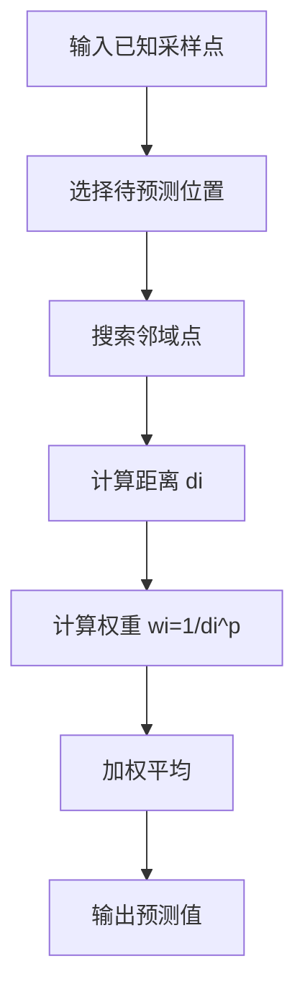
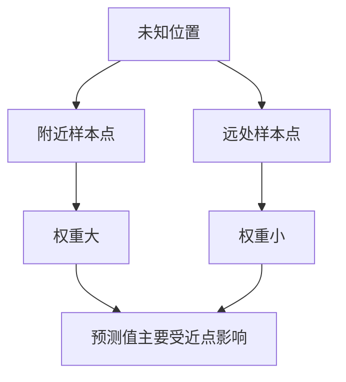

# IDW 算法解释

## 资料来源

- Esri ArcGIS Pro 官方文档：IDW 假设距离越近的点越相似，预测未知位置时更重视附近已测点；权重随距离增大而减小。[How inverse distance weighted interpolation works](https://doc.esri.com/en/arcgis-pro/latest/help/analysis/geostatistical-analyst/how-inverse-distance-weighted-interpolation-works.html)
- Esri ArcGIS Pro 官方文档：IDW 输出值受输入样本值范围限制；`power` 控制周围点影响程度，默认常用值为 2；搜索半径控制参与插值的点集合。[IDW Spatial Analyst Tool](https://doc.esri.com/en/arcgis-pro/latest/tool-reference/spatial-analyst/idw.html)

## 一句话定义

IDW 是一种用“距离越近影响越大”的规则，根据已知点估计未知位置数值的插值算法。

它的核心思想很直观：离目标点越近的样本点，越应该相信；离得越远，影响越小。

## 使用场景

IDW 常用于从离散采样点生成连续表面。

典型场景：

- 地形高程插值
- 温度、湿度、污染浓度空间分布估计
- 压力、厚度、亮度等二维场重建
- 工业检测中稀疏测量点到整面热力图的估计
- 传感器阵列数据补点
- 图像或点云中的稀疏值填补

在工业视觉里，如果你有一批离散测量点，例如局部亮度校正点、胶量采样点、表面高度点，想估计整幅区域的连续分布，IDW 可以作为简单、确定、易实现的方案。

## 为什么使用它

最简单的方法是最近邻：

```text
未知点的值 = 离它最近的那个样本点的值
```

问题是最近邻会产生突变，结果像一块块拼图，不够平滑。

另一种方法是全局平均：

```text
未知点的值 = 所有样本点平均值
```

问题是它完全忽略空间位置，局部变化会被抹平。

IDW 在两者之间折中：

- 近点影响大。
- 远点影响小。
- 输出是加权平均，因此结果相对平滑。
- 实现简单，不需要训练模型。
- 行为确定，便于工程排查。

## 核心原理

设已知样本点为：

```text
(x1, y1, v1)
(x2, y2, v2)
...
(xn, yn, vn)
```

现在要估计未知位置：

```text
(x, y)
```

IDW 会先计算未知位置到每个样本点的距离：

```text
di = distance((x, y), (xi, yi))
```

再给每个点一个权重：

```text
wi = 1 / di^p
```

最后做加权平均：

```text
V(x, y) = sum(wi * vi) / sum(wi)
```

其中 `p` 是 power 参数。

`p` 越大，距离的惩罚越强，近点权重越大，远点影响越小。

## 概念链条

### 插值

插值是根据已知点估计未知点。

例如你测了几个位置的温度，但没有测中间位置，就需要用插值估计中间温度。

### 距离

IDW 的基本假设是：

```text
空间距离越近，数值越可能相似。
```

最常用的是欧氏距离：

```text
d = sqrt((x - xi)^2 + (y - yi)^2)
```

### 权重

权重表示一个样本点对未知点的影响程度。

IDW 的权重是距离的反比：

```text
wi = 1 / di^p
```

距离越小，权重越大。

### power 参数

`p` 控制权重衰减速度。

```text
p = 1：远点还有较明显影响，结果更平滑
p = 2：常用折中值，叫反距离平方加权
p 很大：几乎只看最近点，结果更接近最近邻
```

Esri 官方文档也说明，默认常用 `p = 2`，但没有理论依据证明它总是最优，应结合交叉验证或输出效果检查。

### 搜索邻域

实际工程中不会每次都用所有样本点。

常见做法：

- 固定半径：只用一定距离内的点。
- 固定数量：只用最近的 K 个点。
- 分扇区：避免样本点都集中在一个方向。
- 加 barrier：例如断层、墙、边界，阻止跨边界插值。

搜索邻域直接影响速度和结果形状。

## 配图说明

### 处理流程图



### 直觉图



## 输出结果如何理解

IDW 输出的是一个预测值。

如果用于栅格插值，则每个栅格像素都会得到一个浮点值。

因为 IDW 是加权平均，所以输出有一个重要特性：

```text
预测值通常不会超过参与插值样本点的最大值，也不会低于最小值。
```

这意味着：

- 它不会凭空生成比采样点更高的峰值。
- 它也不会生成比采样点更低的谷值。
- 如果真实场中存在未采到的极值，IDW 无法恢复出来。

这是优点，也是限制。

## 失败条件

IDW 容易在以下情况下出问题：

- 样本点太稀疏，无法表达真实变化。
- 样本点分布极不均匀，某些区域点密集、某些区域点缺失。
- 存在离群点，离群点会在周围形成异常影响。
- 真实现象有方向性，但使用了各向同性距离。
- 存在物理边界，例如墙、断层、遮挡，但没有加入 barrier。
- 数据不是局部连续的，例如突变边缘或分区现象。
- `p` 选得不合适：
  - 太小会过度平滑。
  - 太大会出现块状或靶心效应。

Esri 官方文档明确指出，IDW 对聚类和离群点敏感，并且不提供预测标准误差，因此使用它时需要谨慎证明合理性。

## 工程实现注意点

### 复杂度

如果每个预测点都和所有样本点计算距离，复杂度大约是：

```text
O(M * N)
```

其中：

- `M` 是待预测点数量。
- `N` 是样本点数量。

大图或大栅格下，这个复杂度可能很高。

优化方法：

- 使用 KDTree / cKDTree 查找最近 K 个点。
- 限制搜索半径。
- 分块处理栅格。
- 对固定采样点预构建空间索引。
- 多线程处理不同输出块。

### C++ 实现思路

核心伪代码：

```cpp
double idwPredict(
    const std::vector<PointValue>& samples,
    double x,
    double y,
    double power)
{
    double weightedSum = 0.0;
    double weightSum = 0.0;

    for (const auto& s : samples) {
        const double dx = x - s.x;
        const double dy = y - s.y;
        const double d2 = dx * dx + dy * dy;

        if (d2 < 1e-12) {
            return s.value; // 正好落在采样点上
        }

        const double d = std::sqrt(d2);
        const double w = 1.0 / std::pow(d, power);

        weightedSum += w * s.value;
        weightSum += w;
    }

    return weightedSum / weightSum;
}
```

实时场景中，不建议对每个输出点遍历全部样本点。应使用空间索引找邻域点。

### 参数建议

`power`：

- 常见初始值：`2`
- 更平滑：降低到 `1` 或 `1.5`
- 更强调局部：提高到 `2.5` 或 `3`

邻域点数量：

- 太少：结果不稳定，容易块状。
- 太多：结果过度平滑，计算变慢。
- 工程上可从 `8~16` 个邻点开始试。

搜索半径：

- 半径太小：可能出现无数据区域。
- 半径太大：远点影响过多，结果变平。

## 与工业视觉的关系

IDW 不是典型图像缺陷检测算法，但它可以辅助生成连续场：

- 用稀疏采样点估计整幅图光照背景。
- 用少量标定点生成平面校正图。
- 对传感器稀疏测量结果做空间补点。
- 对产品表面高度或厚度测量点生成热力图。

但要注意：

```text
如果缺陷是突变型边缘，IDW 会把它抹平。
如果真实场存在方向性纹理或物理边界，普通 IDW 会跨边界扩散。
```

因此 IDW 更适合连续缓变场，不适合恢复突变结构。

## 已验证事实、工程判断与推断

**已验证事实**

- Esri 官方文档说明 IDW 假设近处点更相似，近点权重大，远点权重随距离减小。
- Esri 官方文档说明 power 参数控制距离衰减，`p=2` 是常用默认值但不保证总是最优。
- Esri 官方文档说明 IDW 输出值受参与插值样本值范围限制，并对聚类和离群点敏感。

**工程经验判断**

- 实时或大规模插值应使用 KDTree/cKDTree 或网格索引降低邻域搜索成本。
- 工业视觉中 IDW 适合估计缓变背景或校正场，不适合处理突变缺陷边缘。
- 参数应通过交叉验证、残差图或现场样本回放确定。

**推断**

- 如果你的采样点来自亮度标定或高度标定，IDW 可以作为简单、稳定、可解释的第一版方案。
- 如果材料纹理存在方向性或边界隔断，应考虑各向异性距离、分区插值或更高阶模型。

## 初学者总结

IDW 的心智模型是：

```text
未知点的值，由周围已知点投票决定。
离得越近，票权越大。
离得越远，票权越小。
```

以后遇到“只有少量采样点，但想估计整个区域的连续值”的问题，可以先想到 IDW。

但它的前提是：这个值在空间上是连续缓变的。如果真实变化有突变、边界或方向性，普通 IDW 可能会给出看起来平滑但实际错误的结果。
