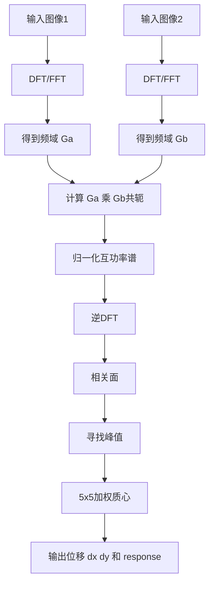
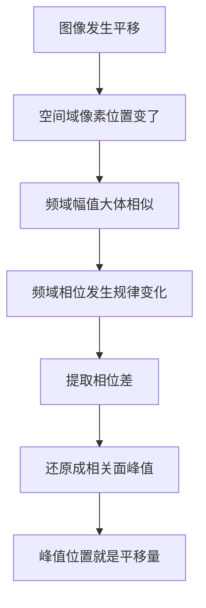

# PhaseCorrelate 算法解释

## 资料来源

- OpenCV 官方文档：`cv::phaseCorrelate` 用于检测两幅图之间的平移偏移，利用傅里叶位移定理，可用于快速图像配准和运动估计；其流程包括 Hanning 窗、DFT、互功率谱、逆 DFT、峰值和 5x5 加权质心亚像素估计。[OpenCV Motion Analysis and Object Tracking](https://docs.opencv.org/4.x/d7/df3/group__imgproc__motion.html)
- OpenCV 官方文档：`cv::createHanningWindow` 用于生成二维 Hanning 窗系数。[OpenCV createHanningWindow](https://docs.opencv.org/4.x/d7/df3/group__imgproc__motion.html)

## 一句话定义

PhaseCorrelate 是一种用频域相位信息来估计两幅图像之间平移量 `(dx, dy)` 的算法。

它不是用肉眼在空间域里“一格一格滑动匹配”，而是把图像变到频域，通过相位差快速找出整体位移。

## 使用场景

PhaseCorrelate 主要用于两幅图内容基本一致、但位置发生平移的情况。

常见场景：

- 图像配准
- 模板或 ROI 对齐
- 相机抖动补偿
- 连续帧位移估计
- 印刷图案位置修正
- 缺陷检测前的基准图对齐
- 工业视觉中产品位置轻微漂移的补偿

在工业视觉里，它适合做“全局平移估计”，例如产品在输送带上左右偏了几像素，需要先把 ROI 对齐再检测缺陷。

## 为什么使用它

最朴素的办法是空间域滑窗匹配：把图像 B 在图像 A 上到处移动，每个位置都算一次相似度，最大相似度的位置就是偏移量。

问题是：

- 大图上滑窗匹配计算量高。
- 如果要亚像素精度，还要额外拟合。
- 整体亮度变化会影响普通相关匹配。

PhaseCorrelate 的价值是：

- 对大图平移估计通常更快。
- 能输出亚像素级位移。
- 使用归一化互功率谱后，更关注相位差，对整体亮度幅值变化不那么敏感。

注意：它解决的是“平移”问题，不是通用匹配问题。若存在明显旋转、缩放、形变，它不一定可靠。

## 核心原理

PhaseCorrelate 的基础是傅里叶位移定理。

直观理解：

如果图像 B 是图像 A 平移得到的，那么两张图的“频率成分强度”基本一样，但这些频率成分的位置关系变了。这个“位置关系”在频域里主要体现在相位上。

所以算法不直接比较像素，而是：

1. 把两张图做 DFT/FFT，进入频域。
2. 比较两张图的相位差。
3. 去掉幅值影响，得到归一化互功率谱。
4. 把相位差逆变换回空间域。
5. 得到一张相关面。
6. 相关面峰值所在位置就是两张图的平移量。

OpenCV 官方文档给出的核心公式是：

```text
Ga = F{src1}
Gb = F{src2}

R = (Ga * Gb*) / |Ga * Gb*|

r = F^-1{R}

(dx, dy) = weightedCentroid(argmax(r))
```

其中：

- `F` 是正向 DFT。
- `F^-1` 是逆 DFT。
- `Gb*` 是 `Gb` 的复共轭。
- `R` 是归一化互功率谱。
- `r` 是相关面。
- `argmax(r)` 是相关面峰值位置。
- `weightedCentroid` 是峰值附近的加权质心，用来得到亚像素位移。

## 概念链条

### 图像平移

图像平移指的是图像内容整体移动：

```text
B(x, y) = A(x - dx, y - dy)
```

也就是说，B 的每个点都来自 A 中偏移 `(dx, dy)` 的位置。

### FFT / DFT

DFT 把图像从空间域变到频域。

空间域看到的是像素灰度：

```text
这个位置亮一点，那个位置暗一点
```

频域看到的是图像由哪些“波”组成：

```text
低频：大范围缓慢变化，比如背景亮度
高频：边缘、纹理、细节
```

FFT 是 DFT 的快速算法实现。工程上通常说 FFT，是指用高效算法算 DFT。

### 幅值和相位

频域中的每个频率分量可以理解成一个复数，包含：

- 幅值：这个频率成分有多强。
- 相位：这个频率模式在空间中的位置关系。

图像平移时，幅值结构变化不大，主要变化体现在相位上。

### 互功率谱

互功率谱用于比较两张图在频域中的关系：

```text
Ga * Gb*
```

`Gb*` 是复共轭。这个乘法可以提取两张图之间的相位差。

### 归一化互功率谱

PhaseCorrelate 使用的是归一化互功率谱：

```text
R = (Ga * Gb*) / |Ga * Gb*|
```

除以幅值后，结果主要保留相位差，削弱亮度强弱对结果的影响。

这是关键点。没有归一化时，强纹理、强亮度区域会主导结果；归一化后，算法更专注于“位移造成的相位差”。

### 相关面

把 `R` 做逆 DFT 后得到 `r`，这就是相关面。

相关面可以理解成一张“位移可能性图”：

```text
r(x, y) 越大，说明这个位移越可能是真实位移
```

理想情况下，相关面上会有一个明显尖峰。这个峰的位置就是图像 B 相对图像 A 的平移量。

### 亚像素估计

真实位移不一定刚好是整数像素。例如产品偏移可能是 `2.35 px`。

OpenCV 会在峰值附近使用 5x5 加权质心来估计亚像素位移。

## 配图说明

### 处理流程图



### 直觉图



## 输出结果如何理解

OpenCV `cv::phaseCorrelate` 输出：

```cpp
cv::Point2d shift = cv::phaseCorrelate(src1, src2, window, &response);
```

含义：

- `shift.x`：x 方向平移量，通常是亚像素浮点数。
- `shift.y`：y 方向平移量。
- `response`：峰值附近信号强度的归一化指标，最大接近 1。

`response` 不是绝对置信度，但可以作为可靠性参考。

工程判断：

- 单峰明显、`response` 高：结果相对可信。
- 多峰、`response` 低：可能有重复纹理、低纹理、遮挡或 ROI 选错。
- 位移超过合理范围：即使 `response` 不低，也要怀疑结果。

## 失败条件

PhaseCorrelate 容易在以下条件下失效或不稳定：

- 两图之间存在明显旋转。
- 两图之间存在尺度变化。
- 产品有明显形变。
- ROI 中是周期性纹理，例如规则网格、重复印刷点。
- 图像纹理太少，相关面没有明显峰。
- 缺陷、遮挡或脏污占据大面积。
- 局部光照变化强，不是简单整体亮度变化。
- 图像边界突变明显，但没有使用 Hanning 窗。
- 两张图不是同一内容，只是局部相似。

常见误区：

```text
PhaseCorrelate 不是万能图像匹配。
它主要适合估计平移，不适合直接处理旋转、缩放、非刚性形变。
```

## 工程实现注意点

### OpenCV 4.5.5 示例

```cpp
cv::Mat img1f;
cv::Mat img2f;
img1.convertTo(img1f, CV_64F);
img2.convertTo(img2f, CV_64F);

cv::Mat hann;
cv::createHanningWindow(hann, img1f.size(), CV_64F);

double response = 0.0;
cv::Point2d shift = cv::phaseCorrelate(img1f, img2f, hann, &response);

if (response < 0.2) {
    // 结果可能不可靠，需要 fallback
}
```

### 实时工业视觉建议

- 输入使用单通道浮点图，避免类型隐式转换。
- ROI 尽量稳定，不要把大面积背景或无关区域放进去。
- Hanning 窗可以预先创建并缓存，尺寸不变时不要每帧重建。
- 高频调用时预分配 `cv::Mat`，减少 hot path heap allocation。
- 对输出位移加范围限制，例如 `abs(dx) < maxShiftX`。
- 对 `response`、历史帧平滑性、相关面峰值唯一性做联合判断。
- 如果产品可能旋转，先做粗定位或角度校正，再用 PhaseCorrelate。

### 时间复杂度

主要成本来自 DFT/FFT，通常近似：

```text
O(N log N)
```

其中 `N` 是 ROI 像素数。大图上比全范围滑窗匹配更有优势，但如果 ROI 很小，普通模板匹配也可能足够。

## 已验证事实、工程判断与推断

**已验证事实**

- OpenCV 文档明确说明 `phaseCorrelate` 用于检测两图之间的平移偏移。
- OpenCV 文档给出了 DFT、归一化互功率谱、逆 DFT、峰值和 5x5 加权质心流程。
- OpenCV 文档说明 Hanning 窗用于减少边界效应。

**工程经验判断**

- 工业视觉中应结合 ROI、`response`、位移范围和历史稳定性判断结果。
- 对重复纹理和低纹理区域不能盲信结果。
- Hanning 窗和缓冲区应缓存，避免实时路径重复分配。

**推断**

- 如果现场产品存在轻微平移但无明显旋转缩放，PhaseCorrelate 可作为 ROI 对齐的低成本方案。
- 如果产品存在周期纹理或大面积缺陷，单独使用 PhaseCorrelate 风险较高，需要 fallback。

## 初学者总结

PhaseCorrelate 的心智模型是：

```text
图像平移会让频域相位产生规律变化。
算法提取这个相位差，再变回空间域。
相关面上的最高峰，就是两张图的位移。
```

以后遇到“两个图像内容差不多，只是整体偏了一点，需要快速求偏移”的问题，可以优先想到 PhaseCorrelate。
