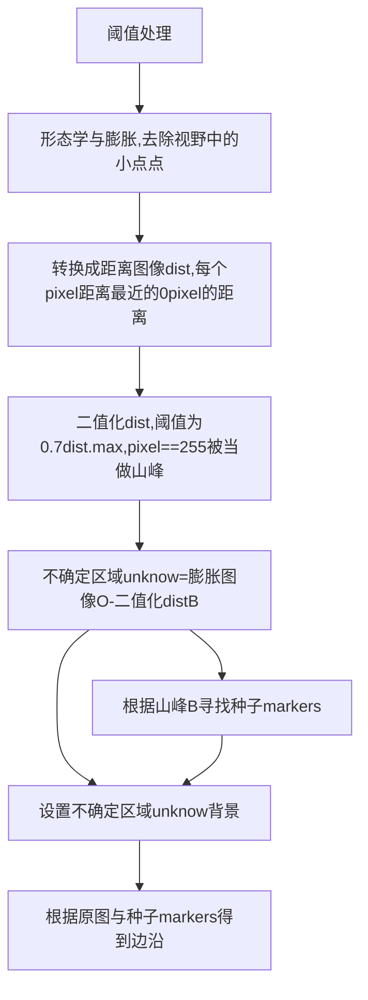
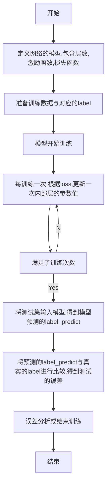

# Image Process

<!-- TOC -->

- [分割、识别、缺陷等几个大方向](#分割识别缺陷等几个大方向)
    - [阈值法](#阈值法)
    - [OTSU](#otsu)
    - [卷积算子(高斯、sobel)](#卷积算子高斯sobel)
    - [区域生长](#区域生长)
    - [分水岭](#分水岭)
    - [HOG & DPM](#hog--dpm)
        - [HOG](#hog)
            - [具体分析](#具体分析)
        - [DPM(Deformable part-based model)](#dpmdeformable-part-based-model)
    - [关键点检测](#关键点检测)
    - [SIFT(Scale-invariant feature transform 尺度不变特征转换)](#siftscale-invariant-feature-transform-尺度不变特征转换)
        - [ORB](#orb)
    - [HOUGH检测](#hough检测)
        - [直线](#直线)
            - [霍夫空间](#霍夫空间)
            - [标准霍夫线变换算法流程](#标准霍夫线变换算法流程)
            - [统计概率霍夫变换算法流程](#统计概率霍夫变换算法流程)
        - [圆](#圆)
            - [经典hough圆](#经典hough圆)
            - [hough梯度法](#hough梯度法)
    - [角点检测](#角点检测)
    - [插值方法](#插值方法)
    - [直方图](#直方图)
    - [利用直方图，进行图像识别](#利用直方图进行图像识别)
        - [KNN](#knn)
        - [k-平均聚类算法（k -means Clustering）](#k-平均聚类算法k--means-clustering)
    - [linemod 模板匹配](#linemod-模板匹配)
    - [神经网络的搭建与原理](#神经网络的搭建与原理)
        - [基本介绍](#基本介绍)
        - [利用神经网络对图像HOG特征进行学习,分辨蝾螈的头](#利用神经网络对图像hog特征进行学习分辨蝾螈的头)
            - [涉及要点](#涉及要点)
    - [SVM](#svm)
    - [标定程序设计与接口](#标定程序设计与接口)
    - [双目成像系统](#双目成像系统)
        - [行对准图像](#行对准图像)
        - [生成深度图](#生成深度图)

<!-- /TOC -->

[github:opencv](https://github.com/opencv/opencv)
[github:opencv_contrib](https://github.com/opencv/opencv_contrib)
[个人实验代码](https://github.com/JockerLin/CV)

## 分割、识别、缺陷等几个大方向

### 阈值法

有固定阈值与自适应阈值，固定阈值即给定一个像素分界线，像素值大于分界的为positive，像素值小的为negative；自适应阈值在当前像素的block size(n*n(奇数))内选择当前block的局部阈值，将中心像素与局部阈值作比较。

太粗暴简单，哪怕是自适应的局部阈值法，一样难逃无法分割类内方差较大的目标的宿命。它完全没有利用好像素的空间信息，导致分割结果极其容易受噪声干扰，经常出现断裂的边缘，需要后处理。

常用接口:

```python
cv2.threshold
cv2.adaptiveThreshold
```

闭运算：先腐蚀再膨胀，解决轮廓某部分突变

开运算：先膨胀后腐蚀，消除裂开的轮廓


### 图像预处理-形态学

### 图像预处理-滤波

对以下滤波方法分析：均值mean，中值median，高斯gauss，双边bilateral、二项binomial

所使用的噪声类型：白噪声、椒盐噪声、均值噪声、高斯噪声

(椒盐噪声：一定信噪比下的随机像素值，“椒”代表胡椒，像素值为0黑色，“盐”代表盐巴，像素值为255白色)


#### 1) 均值mean

对mask区域做像素均值提取
$$
\texttt{K} = \frac{1}{\texttt{ksize.width*ksize.height}} \begin{bmatrix} 1 & 1 & 1 & \cdots & 1 & 1 \\ 1 & 1 & 1 & \cdots & 1 & 1 \\ \cdots\cdots \\ 1 & 1 & 1 & \cdots & 1 & 1 \\ \end{bmatrix}
$$
code:

```c++
int ksize = 5;
// halcon
meanImage(TiledImage, &ImageMean, ksize, ksize);
// cv
blur(*temp_image, *temp_output_image, Size(ksize, ksize));

```


#### 2) 中值median

取mask区域内的中值
$$
\texttt{value} =\frac{\texttt{sum(mask)}}{\texttt{number}}
$$
code:

```c++
int ksize = 5;
// halcon
medianImage(TiledImage, &ImageMedian, "square", ksize, "mirrored");
// cv
medianBlur(*temp_image, *temp_output_image, ksize);

```


#### 3) 高斯gauss

利用正态分布对图像进行模糊化处理

一维度正态分布：


μ为均值，σ为方差，计算的时候，μ是x的均值，σ是x的方差。因为计算平均值的时候，中心点就是原点，所以μ等于0。


二维正态分布：


自定义算完核内元素之后，核内中心坐标为`(0,0)`记得归一化，使`sum(kernel)==1`

通过指定方差与核宽来生成gauss滤波器，后对图像进行卷积操作，得到轮完之后的新数组(图像)。

以方差σ=1.5，核宽size=3为例，滤波器为：

```text
归一化之前：
[[0.04535423 0.05664058 0.04535423]
 [0.05664058 0.07073553 0.05664058]
 [0.04535423 0.05664058 0.04535423]]

kernel = kernel/sum(kernel)

归一化之后：
[[0.09474166 0.11831801 0.09474166]
 [0.11831801 0.14776132 0.11831801]
 [0.09474166 0.11831801 0.09474166]]
```

visionpro 中高斯采样器的Sigma计算：设平滑值(高斯核)为s，sigma=sqrt(s(s+2))/2，sigma与核子s尺寸线性相关。
halcon 中Sigma的值与mask核有特殊的一一对应

```
ksize sigmal
3    (0.600)
5    (1.075)
7    (1.550)
9    (2.025)
11   (2.550)
```

code:

```c++
int ksize = 5;
double sigmal=1.41;
// halcon
gaussFilter(TiledImage, &ImageGauss, 7);
// cv
cv::GaussianBlur(*temp_image, *temp_output_image, Size(ksize, ksize), sigmal, sigmal, BORDER_DEFAULT);
```


参考&引用：

[calgauss](https://github.com/JockerLin/CV/blob/master/own/practice/calgauss/calgauss.py)
[高斯模糊的算法](http://www.ruanyifeng.com/blog/2012/11/gaussian_blur.html)


#### 4) 双边bilateral

SigmaRange用于根据当前像素周围ImageJoint的像素来修改滤镜掩模。只有对比度低于SigmaRange的弱边缘区域的像素才会对平滑做出贡献。请注意，在uint2或真实图像中的对比度可能与SigmaRange的默认值有很大的不同，请相应调整该参数。

GenParamName和GenParamValue目前可以用来控制精度和速度之间的权衡（见下文）。

该滤波器能够保留边缘信息，确保梯度大的地方不会被滤波模糊化。


如下图像，第一个噪点10个灰度差，第一个阶梯50灰度差，第二个阶梯100灰度差


若保留20灰度差以上的梯度进行滤波：


发现了10个灰度差的噪点被消除(平滑)了，同理，如下滤波阈值是50,100灰度差，滤波阈值为50的图像下，100的阶梯被保留下来，50的阶梯被平滑了；滤波阈值为100的图像下，无论是50、100的阶梯都被平滑化；


对输入Image和ImageJoint的分析

三种情况

ImageJoint可以理解为对输入图像的maskImage，但是不是二值的图像，相当于定义了哪些地方需要模糊，哪些地方需要保留梯度。

如果Image和ImageJoint是相同的，bilateral_filter的行为就像一个边缘保护平滑，其中SigmaSpatial定义了过滤器掩模的大小。对比度明显大于 SigmaRange 的边缘像素会被保留，而同质区域的像素会被平滑化。

如果Image和ImageJoint不同，Image的每个像素都会受到ImageJoint的影响，用模板进行平滑处理。ImageJoint有强边缘的位置的像素，其对比度明显大于SigmaRange，其平滑化程度低于同区域的像素。

如果ImageJoint是常数，bilateral_filter相当于用SigmaSpatial进行高斯平滑（见gauss_filter或smooth_image）。


原理分析：

双边滤波器可以看做是空间距离与灰度距离的加权，这个加权比例就是SigmalSpatical与SigmalRange。

目标像素：
$$
I^{'}_{i} = \frac{1}{K_i}\sum_{k \in w_i}C_{ik} \cdot S_{ik} \cdot I_k
$$
空间距离：
$$
C_{ik} = exp({\frac{-(i-k)^2}{2 \cdot SigmaSpatial^2}})
$$
灰度距离：
$$
S_{ik} = exp({\frac{-(J_i-J_k)^2}{2 \cdot SigmaRange^2}})
$$

$$
I_i与J_i是Image与ImageJoint在i位置的灰度值，w_i是i的邻域
$$


图解：


SigmaRange越大，边缘越模糊，极限情况为SigmaRange无穷大，忽略常数时，将近为exp（0）= 1，与高斯模板（空间域模板）相乘后可认为等效于高斯滤波。

SigmaRange越小，边缘越清晰，极限情况为SigmaRange无限接近0，接近exp（-∞） = 0，与高斯模板（空间域模板）相乘后，可近似为系数皆相等，等效于源图像。


code:

```c++
int ksize = 5;
// halcon
bilateralFilter(TiledImage, TiledImage, &ImageBilateral, 3, 40, [], []);
// 滚动双边滤波器
for I := 1 to 6 by 1
  bilateral_filter (TiledImage, ImageJoint, ImageJoint, 25, 15, [], [])
endfor
// cv
cv::bilateralFilter(
				*temp_image,
				*temp_output_image,
				ksize,
				bilateral_sigmal_color,
				bilateral_sigmal_space);
```


参考&引用：

[Bilateral Filtering for Gray and Color Images](http://homepages.inf.ed.ac.uk/rbf/CVonline/LOCAL_COPIES/MANDUCHI1/Bilateral_Filtering.html)
[Halcon bilateral_filter (Operator)](https://www.mvtec.com/doc/halcon/13/en/bilateral_filter.html)
[双边滤波（Bilateral Filter）详解](https://blog.csdn.net/Jfuck/article/details/8932978)


#### 5) 二项binomial

使用掩膜大小为MaskWidth * MaskHeight像素的二项式滤镜平滑图像，并返回平滑后图像。 二项式滤波器只需使用整数运算即可非常高效地实现近似高斯滤波器的效果。该滤波效果只与核尺寸相关。


二项式定义：
$$
{\displaystyle (x+y)^{4}\;=\;x^{4}\,+\,4x^{3}y\,+\,6x^{2}y^{2}\,+\,4xy^{3}\,+\,y^{4}.}
$$


$$
{\displaystyle ax^{b}y^{c}} \texttt{称作二项式系数，记做} {\displaystyle {\tbinom {n}{b}}} or {\displaystyle {\tbinom {n}{a}}}
$$

$$
{\tbinom {n}{a}} = \frac{n!}{a!(n-a)!}
$$

$$
\texttt{位置i,j,核宽高mn像素值：} b_{ij}=\frac{1}{2^{n+m-2}}{\tbinom {m-1}{i}}{\tbinom {n-1}{j}}
$$

举例：以ksize=3的卷积核为：


code:

```c++
int ksize = 5;
// halcon
binomialFilter(TiledImage, ImageBinomial1, ksize, ksize);
// cv
// diy
```


#### 6) 对比图像

以四种噪声为输入图像

原图：


噪声图像：

从左到右分别是：白噪声、椒盐噪声、均值噪声、高斯噪声


用以上预处理方法做横向对比， 合成图像尺寸4096X650，查看输出图像：

均值 1ms：


中值 28ms：


高斯 3ms：


双边 200ms：


二项：2ms


#### 7) 综合分析

均值方法能抑制均值噪声，中值滤波对椒盐噪声的过滤效果明显，双边滤波能够保持边缘特性，同时平滑某梯度阈值下的图像，高斯滤波与二项滤波类似，产生中心占比大两边占比小的滤波效果。

实际使用过程中先判断噪声类型予以选择合适方法。


### OTSU

OTSU work:

[参考](https://zhuanlan.zhihu.com/p/95034826)

通过最大化类间方差计算阈值，能够最好的分割前景和背景。

历遍每一个灰度值

定义：
$$
g = w_0*(u_0-u)^2+w_1*(u_1-u)^2\\
u0 = n0灰度累加和/n0\\
g:类间方差（那个灰度的g最大，哪个灰度就是需要的阈值t）\\
u0：前景平均灰度\\
u1：背景平均灰度\\
t ：灰度阈值（我们要求的值，大于这个值的像素我们将它的灰度设置为255，小于的设置为0）\\
n0：小于阈值的像素，前景\\
n1：大于等于阈值的像素，背景\\
w0：前景像素数量占总像素数量的比例 \\
w1：背景像素数量占总像素数量的比例 \\
$$

$$
u = w_0 * u_0 + w_1 * u_1\\
g = w_0 * w_1 * (u_0 - u_1) ^ 2
$$

[github代码:otsu.py](https://github.com/JockerLin/CV/blob/master/own/practice/threshold/otsu.py)

### 卷积算子(高斯、sobel)

Gauss:


### 区域生长

### 分水岭




[github代码:watershed.py](https://github.com/JockerLin/CV/blob/master/own/practice/watershed/watershed.py)

### HOG & DPM

#### HOG

- 梯度计算
- 单元划分
- 区块选择
- 区间归一化


[参考:图像学习-HOG特征](https://zhuanlan.zhihu.com/p/33059421)

[参考:Histogram of Oriented Gradients](https://www.learnopencv.com/histogram-of-oriented-gradients/)

[HOG、LBP 和 Haar 三大特征](https://zhuanlan.zhihu.com/p/104670289)


##### 具体分析

在经过normalize之前，还需要经过一个average的过程，当前的直方向量(9×1)会除一个数，这个数由周围的9个直方数据决定。

在使用skimage上，[64,128]的img，cell大小为(8,8)，归一化block为(2,2)，**归一化**之后的向量数组为7*15*2*2*9=3780。

[github代码:hog_release.py](https://github.com/JockerLin/CV/blob/master/own/practice/hog/hog_release.py)

#### DPM(Deformable part-based model)

(VOC07,08,09年的检测冠军)

分属于目标检测算法,DPM是HOG的拓展。


HOG&LInear SVM是直接对一张图片求梯度特征后预测出整个人体的位置信息

DPM&Latent SVM是使用对人体分部分检测，得到例如头的roi，手的roi，脚、腿roi，根据这些子模块计算与主模块人整体之间的距离量，根据子模块预测出主模块(人体)的位置信息。

### 关键点检测

### SIFT(Scale-invariant feature transform 尺度不变特征转换)

SIFT 特征在空间尺度中寻找极值点，并提取出其位置、尺度、旋转不变量，是基于物体上的一些局部外观的兴趣点而与影像的大小和旋转无关。

不同theta的高斯模糊相减能得到关键点信息，利用高斯金字塔的每一层获取不同尺寸img的关键点信息。


主要流程：
1、构造DOG尺度空间
2、关键点搜索与定位
3、关键点方向
4、关键点描述
5、特征匹配

**DOG尺度空间**
一、定义
尺度空间中各尺度的图像模糊程度逐渐增大，尺度越大，图像越模糊。
模糊的方法联系高斯模糊的知识点：为了让尺度体现其连续性，高斯金字塔在简单降采样的基础上加上了高斯滤波。将图像金字塔每层的一张图像使用不同参数做高斯模糊，使得金字塔的每层含有多张高斯模糊图像，将金字塔每层多张图像合称为一组(Octave)，金字塔每层只有一组图像，组数和金字塔层数相等。

Lindeberg等人已证明**高斯卷积核是实现尺度变换的唯一变换核**，并且是唯一的线性核。

二、哪些是要查找的特征点？
目的是要不同尺度图像下都能检测出的点，所以，这些点是具有方向信息的局部极值点。不会受尺寸、光照、旋转等因素的影响，例如角点、边缘、暗区域的亮点与亮区域的暗点。

三、多尺度多分辨率
尺度空间与金字塔的区别：
尺度空间的图像系列是由不同高斯核卷积得到，细节逐步丢失，具有相同的分辨率；
金字塔采用抽层降采样的方法，每层分辨率成倍减少；

四、**DOC差分金字塔**

高斯金字塔：对图像做高斯滤波平滑+金字塔降采样
各层金字塔img分辨率不同，在每层的金字塔内，使用不同theta值能获取许多相同分辨率的img。
（用一维高斯核分别对行列卷积实现加速效果）

差分图像：对同一层内的不同theta产生的gauss img相减，得到差分图像


本例拿一张建筑物的img做参考：


可以看到，doc图像提取到一些轮廓特征比原图能够更好地识别到。

**极值点计算**


关键点是由DOG空间的局部极值点组成的，局部极值点是框选一个roi，判断中心点的像素与周围点的像素差是否都满足在某个范围内。

每一幅高斯差分差分img中的每一个像素点(图中的X)要与上下层、本层周围的其他26个像素点比较，确保在尺度空间和本层的图像空间能够检测到极值点。

具体步骤：

1、历遍差分金字塔内所有img，获取特定分辨率与尺度下的高斯差分图像$I_{o,s}$；

2、同组当前层，中心像素满足设定阈值才进入下一步的周围8像素领域比较，若该领域存在中心像素为极大极小值的情况，则认为中心像素是极值点，进行下一步；

3、同组不同层，在$I_{o,s}$的上下两层高斯差分图像$I_{o,s-1}$与$I_{o,s+1}$中，若上下两层邻域内(18pixel)存在center是相对极值点，则确定该center是本层与上下邻域内的(26pixel)极值点；

4、将确定极值点的坐标加入集合；

实验证明：在s0(=3)组内层数的尺度下获取极值点是比较高效的表现。在极值点比较的过程中，总高斯差分层数为s下，每一副图像的首尾s//2层是无法比较极值的，因此需要在每一组图像的顶层用高斯模糊生成s0(3)幅图像，高斯金字塔每组就有s+s0(s+3)图像，差分金字塔每组s+s0-1(s+2)层图像，因此需要牺牲的高斯金字塔层数为0,1,s层。

**抽取稳定关键点**

对极值点筛选，才作为关键点。
DoG值对噪声和边缘较敏感

1、去除低对比度
将每个高斯差分图像中的极值点映射回原图像的像素上，判断是否满足阈值要求。

2、去除边缘相应点

#### ORB

### HOUGH检测

[参考:霍夫梯度法的原理](https://www.cnblogs.com/kk17/p/9693132.html#%E9%9C%8D%E5%A4%AB%E6%A2%AF%E5%BA%A6%E6%B3%95%E7%9A%84%E5%8E%9F%E7%90%86%E5%8D%B3%E7%AE%97%E6%B3%95%E6%B5%81%E7%A8%8B%E4%B8%A4%E4%B8%AA%E7%89%88%E6%9C%AC%E7%9A%84%E8%A7%A3%E9%87%8A)

#### 直线

##### 霍夫空间

一般直线方程为y=kx+b

将x，y坐标空间转到k，b坐标空间，在xy空间的一条线L1，在kb空间就相当于一个点P1，因为L1上的点拥有相同的kb值，而在kb空间的一条线L2，可以看做在xy空间下的一点P2，L2上的每个点都是xy中过点P2的一条直线。

即xy的一般Hough方程是：b=-kx+y

为了避免许多奇异点的出现，将方程改写如下：

$$
p = xcos\theta + ysin\theta
$$

表示了x、y坐标空间到Θ、P代表的HOUGH空间的转换。

##### 标准霍夫线变换算法流程

1. 读取原始图像，并转换成灰度图，利用阈值分割或者边缘检测算子转换成二值化边缘图像
2. 初始化霍夫空间， 令所有𝑁𝑢𝑚(𝜃,𝑝)=0
3. 对于每一个像素点(𝑥,𝑦)，在参数空间中找出所有满足𝑥𝑐𝑜𝑠𝜃+𝑦𝑠𝑖𝑛𝜃=𝑝的(𝜃,𝑝)对,然后令𝑁𝑢𝑚(𝜃,𝑝)=𝑁𝑢𝑚(𝜃,𝑝)+1
4. 统计所有𝑁𝑢𝑚(𝜃,𝑝)的大小，取出𝑁𝑢𝑚(𝜃,𝑝)>τ的参数（τ是所设的阈值），从而得到一条直线。
5. 将上述流程取出的直线，确定与其相关线段的起始点与终止点（有一些算法，如蝴蝶形状宽度，峰值走廊之类）

##### 统计概率霍夫变换算法流程

标准霍夫变换本质上是把图像映射到它的参数空间上，它需要计算所有的M个边缘点，这样它的运算量和所需内存空间都会很大。如果在输入图像中只是处理𝑚(𝑚<𝑀)个边缘点，则这m个边缘点的选取是具有一定概率性的，因此该方法被称为概率霍夫变换（Probabilistic Hough Transform）。

该方法还有一个重要的特点就是能够检测出线端，即能够检测出图像中直线的两个端点，确切地定位图像中的直线。HoughLinesP函数就是利用概率霍夫变换来检测直线的。它的一般步骤为：

1. 随机抽取图像中的一个特征点，即边缘点，如果该点已经被标定为是某一条直线上的点，则继续在剩下的边缘点中随机抽取一个边缘点，直到所有边缘点都抽取完了为止；
2. 对该点进行霍夫变换，并进行累加和计算；
3. 选取在霍夫空间内值最大的点，如果该点大于阈值的，则进行步骤4，否则回到步骤1；
4. 根据霍夫变换得到的最大值，从该点出发，沿着直线的方向位移，从而找到直线的两个端点；
5. 计算直线的长度，如果大于某个阈值，则被认为是好的直线输出，回到步骤1。

#### 圆

##### 经典hough圆

霍夫圆变换和霍夫线变换的原理类似。霍夫线变换是两个参数(r,θ)，霍夫圆需要三个参数，圆心的x,y坐标和圆的半径,他的方程表达式为(𝑥−𝑎)2+(𝑦−𝑏)2=𝑐2,按照标准霍夫线变换思想，在xy平面，三个点在同一个圆上，则它们对应的空间曲面相交于一点（即点(a,b,c))。故我们如果知道一个边界上的点的数目，足够多，且这些点与之对应的空间曲面相交于一点。则这些点构成的边界，就接近一个圆形。上述描述的是标准霍夫圆变换的原理，由于三维空间的计算量大大增大的原因, 标准霍夫圆变化很难被应用到实际中。


##### hough梯度法

第一阶段用于检测圆心，第二阶段从圆心推导出圆半径。

version 1:

2-1霍夫变换的具体步骤为：

1. 首先对图像进行边缘检测，调用opencv自带的cvCanny()函数，将图像二值化，得到边缘图像。

2. 对边缘图像上的每一个非零点。采用cvSobel()函数，计算x方向导数和y方向的导数，从而得到梯度。从边缘点，沿着梯度和梯度的反方向，对参数指定的min_radius到max_radium的每一个像素，在累加器中被累加。同时记下边缘图像中每一个非0点的位置。

3. 从（二维）累加器中这些点中选择候选中心。这些中心都大于给定的阈值和其相邻的四个邻域点的累加值。

4. 对于这些候选中心按照累加值降序排序，以便于最支持的像素的中心首次出现。

5. 对于每一个中心，考虑到所有的非0像素（非0，梯度不为0），这些像素按照与其中心的距离排序，从最大支持的中心的最小距离算起，选择非零像素最支持的一条半径。

6. 如果一个中心受到边缘图像非0像素的充分支持，并且到前期被选择的中心有足够的距离。则将圆心和半径压入到序列中，得以保留。

version 2:

第一阶段：检测圆心

1. 对输入图像边缘检测；

2. 计算图形的梯度，并确定圆周线，其中圆周的梯度就是它的法线；

3. 在二维霍夫空间内，绘出所有图形的梯度直线，某坐标点上累加和的值越大，说明在该点上直线相交的次数越多，也就是越有可能是圆心；(备注：这只是直观的想法，实际源码并没有划线)

4. 在霍夫空间的4邻域内进行非最大值抑制；

5. 设定一个阈值，霍夫空间内累加和大于该阈值的点就对应于圆心。

第二阶段：检测圆半径

1. 计算某一个圆心到所有圆周线的距离，这些距离中就有该圆心所对应的圆的半径的值，这些半径值当然是相等的，并且这些圆半径的数量要远远大于其他距离值相等的数量

2. 设定两个阈值，定义为最大半径和最小半径，保留距离在这两个半径之间的值，这意味着我们检测的圆不能太大，也不能太小

3. 对保留下来的距离进行排序

4. 找到距离相同的那些值，并计算相同值的数量

5. 设定一个阈值，只有相同值的数量大于该阈值，才认为该值是该圆心对应的圆半径

6. 对每一个圆心，完成上面的2.1～2.5步骤，得到所有的圆半径

### 角点检测

Harris 角点检测算法如下：

1、对图像进行灰度化处理；

2、利用Sobel滤波器求出海森矩阵（Hessian matrix）这一步的数学原理可见[这里](https://blog.csdn.net/lwzkiller/article/details/54633670)。
$$
H=\left[\begin{matrix}{I_x}^2&I_xI_y\\I_xI_y&
{I_y}^2\end{matrix}\right]将高斯滤波器分别应用于
$$
$$
{I_x}^2、{I_y}^2、I_x\ I_y
$$
3、计算每个像素的
$$
R = \det(H) - k\ (\text{trace}(H))^2\\
\det(H)
$$
通常K在[0.04,0.16]范围内取值.

4、满足
$$
R \geq \max(R) \cdot\text{th}
$$

的像素点即为角点。

[代码在这里](https://github.com/JockerLin/ImageProcessing100Wen/blob/my_analysis/Question_81_90/answers/answer_83.py)
[参考](https://github.com/gzr2017/ImageProcessing100Wen/blob/master/Question_81_90/README.pdf)

### 插值方法

已转移。

### 直方图

直方图表示了一副图像的像素分布，数据集中在直方图左侧整体就会偏暗，右侧偏亮，直方图的偏向导致了图像的动态范围就比较低。使直方图较为平坦能够让人更清楚的看清图片。

### 利用直方图，进行图像识别

图像识别是识别图像中物体的类别（它属于哪个类）的任务。图像识别通常被称为Classification、Categorization、Clustering等。

一种常见的方法是通过 HOG、SIFT、SURF 等方法从图像中提取一些特征，并通过特征确定物体类别。这种方法在CNN普及之前广泛采用，但CNN可以完成从特征提取到分类等一系列任务。

这里，利用图像的颜色直方图来执行简单的图像识别。算法如下：

1. 将图像`train_***.jpg`进行减色处理（像问题六中那样，RGB取4种值）。
2. 创建减色图像的直方图。直方图中，RGB分别取四个值，但为了区分它们，B = [1,4]、G = [5,8]、R = [9,12]，这样bin=12。请注意，我们还需要为每个图像保存相应的柱状图。也就是说，需要将数据储存在`database = np.zeros((10(训练数据集数), 13(RGB + class), dtype=np.int)`中。
3. 将步骤2中计算得到的柱状图记为 database。
4. 计算想要识别的图像`test@@@.jpg`与直方图之间的差，将差称作特征量。
5. 直方图的差异的总和是最小图像是预测的类别。换句话说，它被认为与近色图像属于同一类。
6. 计算将想要识别的图像（`test_@@@.jpg`）的柱状图（与`train_***.jpg`的柱状图）的差，将这个差作为特征量。
7. 统计柱状图的差，差最小的图像为预测的类别。换句话说，可以认为待识别图像与具有相似颜色的图像属于同一类。


训练数据集存放在文件夹`dataset`中，分为`trainakahara@@@.jpg`（类别1）和`trainmadara@@@.jpg`（类别2）两类，共计10张。`akahara`是红腹蝾螈（Cynops pyrrhogaster），`madara`是理纹欧螈（Triturus marmoratus）。

这种预先将特征量存储在数据库中的方法是第一代人工智能方法。这个想法是逻辑是，如果你预先记住整个模式，那么在识别的时候就没有问题。但是，这样做会消耗大量内存，这是一种有局限的方法。

#### KNN

如果⽐较这两个图像，它们绿⾊和⿊⾊⽐例看起来差不多，因此整个图像颜⾊看起来相同。这是因为在识别的时候，训练图像选择了⼀张偏离⼤部分情况的图像。因此，训练数据集的特征不能很好地分离，并且有时包括偏离特征分布的样本。
为了避免这中情况发⽣，在这⾥我们选择颜⾊相近的三副图像，并通过投票来预测最后的类别，再计算正确率。像这样选择具有相似特征的3个学习数据的⽅法被称为 k-近邻算法（k-NN: k-Nearest Neighbor）。

[代码在这里](https://github.com/JockerLin/ImageProcessing100Wen/blob/my_analysis/Question_81_90/answers/answer_87.py)
[参考](https://github.com/gzr2017/ImageProcessing100Wen/blob/master/Question_81_90/README.pdf)

#### k-平均聚类算法（k -means Clustering）

k-平均聚类算法在类别数已知时使用。在质心不断明确的过程中完成特征量的分类任务。

k-平均聚类算法如下：

1. 为每个数据随机分配类；
2. 计算每个类的重心；
3. 计算每个数据与重心之间的距离，将该数据分到重心距离最近的那一类；
4. 重复步骤2和步骤3直到没有数据的类别再改变为止。

在这里，以减色化和直方图作为特征量来执行以下的算法：

1. 对图像进行减色化处理，然后计算直方图，将其用作特征量；
2. 对每张图像随机分配类别0或类别1（在这里，类别数为2，以`np.random.seed (1)`作为随机种子生成器。当`np.random.random`小于`th`时，分配类别0；当`np.random.random`大于等于`th`时，分配类别1，在这里`th=0.5`）；
3. 分别计算类别0和类别1的特征量的质心（质心存储在`gs = np.zeros((Class, 12), dtype=np.float32)`中）；
4. 对于每个图像，计算特征量与质心之间的距离（在此取欧氏距离），并将图像指定为质心更接近的类别。
5. 重复步骤3和步骤4直到没有数据的类别再改变为止。

在这里，实现步骤1至步骤3吧（步骤4和步骤5的循环不用实现）！将图像`test@@@.jpg`进行聚类。

**计算质心**=>**聚类**=>**调整初期类别**

[代码在这里](https://github.com/JockerLin/ImageProcessing100Wen/blob/my_analysis/Question_81_90/answers/answer_90.py)
[参考](https://github.com/gzr2017/ImageProcessing100Wen/blob/master/Question_81_90/README.pdf)

### linemod 模板匹配

linemod:

通过选择一个模板图像，训练，旋转与缩放得到许多的候选模板图，特征点的方法另外阐述；

目标图像中匹配模板图得到最佳的一个匹配模板，完成匹配。

特征点的选取与计算：

### 神经网络的搭建与原理

#### 基本介绍

看完这个在进行其他神经网络的学习就会发现是换汤不换药。



[代码在这里](https://github.com/JockerLin/ImageProcessing100Wen/blob/my_analysis/Question_81_90/answers/answer_95.py)
[参考](https://github.com/gzr2017/ImageProcessing100Wen/blob/master/Question_91_100/README.pdf)

#### 利用神经网络对图像HOG特征进行学习,分辨蝾螈的头

##### 涉及要点

IOU、HOG、NMS

[代码在这里](https://github.com/JockerLin/ImageProcessing100Wen/blob/my_analysis/Question_81_90/answers/answer_100.py)
[参考](https://github.com/gzr2017/ImageProcessing100Wen/blob/master/Question_91_100/README.pdf)

### SVM

[参考](http://blog.pluskid.org/?page_id=683)

### 标定程序设计与接口

todo:delete ３Ｄ相关的已经归纳到专门一篇

### 双目成像系统

#### 行对准图像

先确定相机的安装方式，踩过坑，相机视野的上下左右是否正确，这决定了反畸变后两幅图像是否能行对准。

在确定了相机的安装方式后，标定相机，得到内参与畸变系数(k1, k2, p1, p2, [k3, [k4, k5, k6]])。

使用stereoRectify对双目进行优化，实现行对准，得到矫正后新的相机内参。

利用新的相机内参计算undistort反畸变图像，看目标时候会超出图像区域，此时的目标先用一张标定时候的图像做参考。

<!--  -->
左：原始图像，右：反畸变图像


在使用initUndistortRectifyMap计算矫正先后的map。

矫正前后图像明显看到是否有**行对准**。


#### 生成深度图
