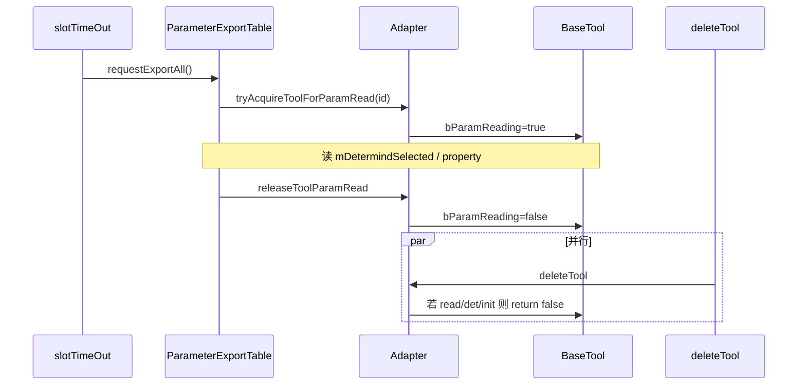

---
title: 参数导出堆损坏排查与修复回顾
categories:
- C++编程
tags:
- c++
- QT
- 并发安全
- 崩溃排查
---

# 参数导出堆损坏（#9）排查与修复回顾

> 整理日期：2026-05-27  
> 关联文档：[2605复检异常问题排查与修复汇总.md](./2605复检异常问题排查与修复汇总.md)（总览 #1–#8）  
> 现场版本：ElectroVision 3.0.5.11，路径含「白鸠口罩-复检-0522_11M5」

---

## 1. 问题现象

| 项 | 内容 |
|----|------|
| 异常码 | `0xC0000374`（堆损坏 / Heap corruption） |
| 模块 | `ntdll.dll`（`RtlFreeHeap` / `RtlReportFatalFailure`） |
| WER | `APPCRASH` + **FaultTolerantHeap**（堆在更早时刻已被破坏，崩溃为延后引爆） |
| 调用栈（DMP） | `QList<QString>::clear()` → `ParameterExportTable::exportAll` → `Qt_Vision::slotTimeOut` → `QTimer` |

与 **#7**（`updateToolChooseItem` → `__updateToolShieldSource`）为 **不同调用链**，但同属「流程/UI 快照里缓存 `BaseTool*` 与 Adapter 生命周期脱钩」这一类问题。

---

## 2. 触发路径

```text
QTimer 100ms
  → Qt_Vision::slotTimeOut
  → timeout_ExportData > 300 且非低功耗（约每 30s）
  → ParameterExportTable::requestExportAll()   // 后台 std::thread
       → exportAllImpl()
            → cameraParameterList.clear()      // 常见崩溃表象
            → GetCameraParameter()
            → GetCore/Global/StationParameter()
            → export*Parameter() 写 CSV/XLSX
```

`exportAll` **不操作 Qt 界面控件**（无 `show`/`update`），主要为 `ParamManager` 读配置 + `QXlsx` 写文件；因此定时触发已改为 `requestExportAll()`，避免占用 UI 线程做磁盘 IO。

---

## 3. 排查过程要点

### 3.1 崩溃点 ≠ 案发点

- 堆校验常在 **`QStringList::clear()`** 或 **`RtlFreeHeap`** 时失败。
- 更可能：**上一轮或同轮** `GetCameraParameter` 中对悬空 `BaseTool*` 读 `mDetermindSelected` / `property()` 已踩堆，到释放字符串列表时才暴露。
- `exportAll` 仅 `catch (std::exception)`，**无法捕获** SEH 堆损坏。

### 3.2 旧代码风险（`GetCameraParameter`）

```cpp
auto cameraTools = AlgorithmToolHelper::GetInstance()->GetCameraTools(i);  // 值拷贝
auto toolImptrs = tools.toolParams[j].AlgoImpl;   // 快照裸指针
toolImptrs->mDetermindSelected...                  // 无 map 校验
tools.toolParams[j].AlgoWidgetImpl->getParamTreeItemStructInfo();
GetModel1/2/3(..., tools.toolParams[j].AlgoImpl, ...);
```

| 风险 | 说明 |
|------|------|
| `AlgoImpl` 与 map 不同步 | 复检、`deleteTool`、延后删除、`UpdateCameraTools` 后快照仍可能指向已释放对象 |
| `mutexAlgMap` 未参与导出读 | `deleteTool` 与导出读无协调 |
| `create == false` 仍可能踩堆 | 即使不进 `GetModel1/2/3`，**79–87 行**仍会读 `toolPtr->mDetermindSelected` |

### 3.3 现场日志（崩溃前约 5s）

```text
07:00:22.776  相机2进入复检界面
07:00:22.839  相机2工具进入复检 / 复检工具清理
07:00:22.848+ 加载 Recheck 工具（7 个）
07:00:23.167  进入复检完毕
07:00:24.723  选中工具 黑接头 / XZJBlobTool_2_0_1
07:00:26.529  相机2离开复检          ← 未看到「应用参数」
07:00:28.006  相机2/3 流程时间过长    ← 在线检测仍在跑
```

**结论**：

- 短时进/出复检 + **在线检测并行**，工具 map 与 `g_CameraFlowTools` 易处于过渡期。
- 崩溃**不一定**发生在 `GetModel`（现场可能 `create == false`），更不能据此排除导出模块或 **其它模块先踩堆、导出处引爆** 的可能。

### 3.4 方案演进（讨论记录）

| 阶段 | 方案 | 评价 |
|------|------|------|
| 初版 | `idName` + `getAlgMapCopy()` 替换快照 `AlgoImpl` | 正确方向；单独 copy 后无锁仍可能被删 |
| 互斥锁 | `exportAll` 全程或每工具长时间 `mutexAlgMap` | 能与 `deleteTool` 互斥，但 **阻塞检测线程拿 map**，占锁时间长 |
| 暂缓删除 | `beginDeferToolDelete` / `endDeferToolDelete` | 可挡删除，但与工程内 **det/init 模式不一致**，且属额外机制 |
| **终版（采纳）** | **`bParamReading` + `tryAcquireToolForParamRead`** | 与 `bDetecting`/`bIsInit` 一致；map 锁仅 **acquire 瞬间**；读参数时不占 map 锁 |

**经验**：堆损坏类问题易默认「加长临界区锁」；本工程已有 **「工具忙则不删」** 惯例，应优先复用 **工具级原子状态 + `deleteTool` 闸门**。

---

## 4. 已落地修复（#9）

### 4.1 `GetCameraParameter`：按 idName 解析工具指针

- 使用 `tools.toolParams[j].idName`，不再用快照 `AlgoImpl` 作为算法实例来源。
- **参数树结构**仍用流程快照 `AlgoWidgetImpl->getParamTreeItemStructInfo()`（按需求保持来源不变）。

### 4.2 工具「参数读取中」状态（与 det/init 同级）

**BaseTool**（`basetool.h` / `basetool.cpp`）：

- `std::atomic<bool> bParamReading`
- `getParamReadingStatus()` / `setParamReadingStatus(bool)`

**Adapter**（`adapter.cpp`）：

- `tryAcquireToolForParamRead(toolId)`：在 `mutexAlgMap` 内确认工具存在 → `bParamReading = true` → 返回指针。
- `releaseToolParamRead(tool*)`：读完置 `false`。
- `deleteTool`：在 `getDetectStatus() || getInitStatus()` 之外增加 **`getParamReadingStatus()`**，为 true 则禁止删除（与现有日志风格一致）。

**ParameterExportTable**（`ParameterExportTable.cpp`）：

```cpp
BaseTool* toolPtr = Adapter::getInstance()->tryAcquireToolForParamRead(toolId);
ToolParamReadGuard readGuard(toolPtr);  // 析构 release
// 使用 toolPtr 读 mDetermindSelected、GetModel1/2/3
```

`GetModel1/2/3` 保留 `tool` 空指针判断。

### 4.3 异步导出

- `requestExportAll()`：`std::thread` 执行 `exportAllImpl()`，`s_exportBusy` 防止重叠导出。
- `Qt_Vision::slotTimeOut` 改为调用 `requestExportAll()`。

### 4.4 与 #7 的关系

| 项 | #7 掩膜源刷新 | #9 参数导出 |
|----|---------------|-------------|
| 栈 | `updateToolChooseItem` → `__update*` | `exportAll` → `GetCameraParameter` |
| 修复 | `QStringList toolIds` + 批次刷新 | `idName` + `bParamReading` |
| 是否互相覆盖 | **否**，需分别改 |

---

## 5. 架构示意



---

## 6. 验证建议

| 场景 | 期望 |
|------|------|
| 产线：进复检 → 点工具 → 离开（不应用）+ 在线检测，运行 >30min | 无 `0xC0000374`；日志可见「禁止删除 read:1」类信息（若删工具撞上导出） |
| 应用复检 + 删工具 + 定时导出交错 | 延后删除仍由 `checkWhethreDeleteDelay` 完成 |
| Page Heap / Application Verifier | 专盯 `GetCameraParameter`、`deleteTool` |
| 临时关闭定时导出 | 若崩溃消失，佐证 #9 时间线重叠 |

---

## 7. 残留风险与维护注意

1. **`bParamReading` 只保护 `deleteTool`**，不保护 `freeLastSpecTool()` 等直接 `delete` 路径。
2. **`AlgoWidgetImpl` 仍为快照指针**；界面 `clear` 后若未置空，仍有理论风险（与 `bParamReading` 无关）。
3. **acquire 后、release 前** 对象不会被 `deleteTool` 删掉，但检测线程仍可能写同一工具属性（与 `bDetecting` 类似，属业务层约束）。
4. 发布需重编：**BaseTool + Adapter + Qt_Vision**，并同步 `compliteenv/include` 头文件。

---

## 8. 关键文件索引

| 主题 | 路径 |
|------|------|
| 导出入口 / 异步 | `Qt_Vision/ParameterExportTable.cpp`：`requestExportAll`、`exportAllImpl`、`GetCameraParameter` |
| 定时触发 | `Qt_Vision/Qt_Vision.cpp`：`slotTimeOut` |
| 读取 acquire/release | `XZJVisionDemoTool/Adapter/adapter.cpp` |
| 删除闸门 | `Adapter::deleteTool` |
| 工具状态位 | `XZJVisionDemoTool/BaseTool/basetool.h`、`basetool.cpp` |
| 对外头文件 | `Common/compliteenv/include/adapter.h`、`basetool.h` |

---

## 9. 结论（一句话）

**#9 堆损坏**：本质是 **导出路径使用与 Adapter 生命周期脱钩的 `AlgoImpl` 快照**；修复应 **按 idName 解析当前工具**，并用与 **`bDetecting`/`bIsInit` 同类的 `bParamReading`** 在删除侧闸门，而不是长时间占用 `mutexAlgMap`；导出 IO 放后台线程，避免阻塞 UI 定时器。

---

*文档版本：2026-05-27*
