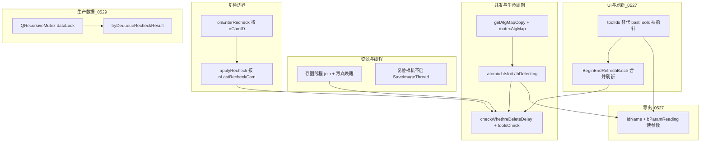

---
title: 复检异常问题排查与修复汇总
categories:
- C++编程
tags:
- c++
- QT
- 并发安全
- 崩溃排查
---

# 2605复检异常问题排查与修复汇总

> 整理日期：2026-05-22  
> 修订：2026-05-29（#10 生产数据 `ProductDataHelper` 并发堆损坏）

---

## 总览

| # | 问题域 | 异常表现 / 风险 | 修复要点 |
|---|--------|-----------------|----------|
| 1 | 执行中删除工具 | 工具 `initialize`/`process` 中被 `deleteTool` → UAF / 堆损坏 | `bIsInit` / `bDetecting` 改为 `std::atomic<bool>`，删除前状态检查 |
| 2 | 真实相机推理 vs 复检模型释放 | 产线怀疑：在线推理时误释复检 YOLO | 压测 Demo **未复现**；需结合停检与对象隔离继续观察 |
| 3 | `__mapName2Algs` 并发 | `0xC0000374` 堆损坏，压测约 8h 一次 | `mutexAlgMap` + `getAlgMapCopy()` |
| 4 | `enterRecheck` 相机范围 | 进入复检误改全部相机工具状态 | `onEnterRecheck` / `onLeaveRecheck` 增加 `nCamID` 匹配 |
| 5 | 图像分割存图线程 | 未启用存图仍阻塞；`detach` + 析构不 join → 延迟堆损坏 | 取消 `detach`，析构 `notify` + `join`（`BaseAITool` 已改，`XZJMMInsSegTool` 待对齐） |
| 6 | 应用复检后删工具 | 固定 **1s** 定时删除与检测不同步 | 主路径改为 `OutPutThread` + `checkWhethreDeleteDelay`；`deleteCamDelayTool` 已禁用 |
| 7 | `updateToolChooseItem` 野指针 | 主线程 `0xC0000374`，栈在 `QList::operator=` / `__updateToolShieldSource` | UI 改存 `idName`；Adapter 锁内 `find` 解析指针 |
| 8 | 初始化时重复刷新掩膜源 | 进入复检 K 个 AI 工具各发信号 → `updateToolChooseItem` 重复 K 次 | `signalBegin/EndRefreshBatch` 批次合并 + `mutexRefreshBatch` |
| 9 | 定时导出参数 CSV | 主线程 `0xC0000374`，栈在 `QList<QString>::clear` / `exportAll` | **已修**：`idName` + `bParamReading` / `tryAcquireToolForParamRead`；`requestExportAll` 后台导出 |
| 10 | `ProductDataHelper` 生产数据并发 | `0xC0000374`，栈在 `LocalFile::saveProductCsvFile` / `xlsx.save`；约 **5s** 定时保存 | **已修**：`QRecursiveMutex dataLock`；读写对称加锁；`recheckResults` 私有化 + `tryDequeueRecheckResult` |

---

## 1. 工具执行中被删除 — 状态位不准确

### 问题描述

删除工具（`Adapter::deleteTool`、`applyRecheck` 清理复检工具、`checkWhethreDeleteDelay` 等）依赖 `getInitStatus()` / `getDetectStatus()` 判断工具是否仍在执行。若标志位在检测子线程与主线程之间缺少可见性保证，可能出现：

- 检测线程已进入 `process`，标志位仍为「空闲」→ 误删；
- 或标志位读写竞态 → 判断结果不稳定。

典型后果：**use-after-free**、`0xC0000374`（堆损坏），与 DMP 中检测线程 `process` 路径崩溃一致。

### 原因分析

- `bIsInit`、`bDetecting` 原为普通 `bool`，多线程读写无内存序保证；
- `deleteTool` 在 `mutexAlgMap` 内检查状态，但 `process` 内在另一线程修改标志位，存在 **检查与执行之间的窗口**（仍需配合延后删除，见第 6 节）。

### 解决方案

| 项 | 说明 |
|----|------|
| 原子标志位 | `BaseTool` 中改为 `std::atomic<bool> bIsInit`、`std::atomic<bool> bDetecting` |
| 访问接口 | `getInitStatus()` / `getDetectStatus()` 使用 `load()`；`process` 入口/出口使用 `store(true/false)` |
| 删除闸门 | `deleteTool`、`checkWhethreDeleteDelay`、`applyRecheck` 删除复检工具前均检查上述状态，忙则 **拒绝删除或延后** |

**关键代码**

- `basetool.h`：`std::atomic<bool> bIsInit`、`bDetecting`
- `basetool.cpp`：`getInitStatus` / `getDetectStatus`、`bDetecting.store` 于 `process` 路径
- `adapter.cpp`：`deleteTool`（约 1513 行）、`checkWhethreDeleteDelay`（约 2999 行）、`applyRecheck` 删除临时工具（约 2845 行）

**注意**：原子标志位解决的是 **可见性与单次读写正确性**；若已 `delete` 对象，快照中的 `AlgoImpl` 仍可能悬空，需配合 `peekTool`、延后删除与 map 并发保护（第 3、6 节）。

---

## 2. 真实相机推理过程中释放复检相机 YOLO 模型

### 问题描述

现场怀疑：某路 **真实相机** 仍在做模型推理（如 YOLO/MM）时，**复检侧** 或 **应用复检/删工具** 流程触发了 `clearModelHandle()` / `yoloDetector.releaseModel()`，导致 GPU/堆状态异常。

相关路径包括：

- `applyRecheck` 批量 `deleteTool` 复检工具 → `~XZJMMInsSegTool` → `clearModelHandle()` → `yoloDetector.releaseModel()`；
- 规格切换、进入/离开复检时的模型生命周期。

### 原因分析（推断）

- 复检工具（`Recheck_*`）与真实工具为 **不同 `BaseTool` 实例**（`recheckCam` 不删真实工具），正常不应「删复检实例」直接影响真实实例的 `yoloDetector`；
- 若 **相机 ID / 工具名** 边界错误，或 **同进程 GPU 资源** 被误释放，仍可能表现为在线推理异常；
- **AdapterTest 压测**（4 相机 `process` + 主线程复检循环）**未复现**该场景，说明需真实相机 + 完整 Qt_Vision 时序才易触发，或属低频竞态。

### 解决方案与现状

| 项 | 状态 |
|----|------|
| `applyRecheck` 仅处理 `nLastRecheckCam` 对应复检工具 | 已加 `nCamID` 判断（见第 4 节） |
| 删除前 `getDetectStatus` / `getInitStatus` | 已配合原子标志位（第 1 节） |
| 删除复检工具改为「输出无该工具后再删」 | 真实工具走延后删除；复检临时工具在 `applyRecheck` 内按状态删除 |
| Demo 复现 | **未复现** — 不能排除产线特有时序，建议保留日志：`YoloRelease`、相机 ID、线程 ID |

**建议产线验证**：应用复检前停检或确认 `processEnd`；抓崩溃 DMP 区分是 **map 竞争**（子线程 `process`）还是 **析构/释放模型**（主线程 `deleteTool`）。

---

## 3. `algMap`（`__mapName2Algs`）同时操作隐患

### 问题描述

- 检测线程：`getAlgMap()` 取指针后 **锁已释放**，无锁遍历 `QMap`；
- 主线程：`recheckCam` / `applyRecheck` 在 `mutexAlgMap` 内插入/删除 **复检工具**；
- QMap 底层红黑树在并发读写下 **迭代器失效**，读到无效 `BaseTool*` → `process` 内 `this` 不可读 → 后续 `QVector::realloc` 触发 **`0xC0000374`**。

`XToolTest.exe`压测约 **8 小时** 出现一次，符合极低概率并发 UB 特征。

### 原因分析

```text
读端：getAlgMap() → 返回 &__mapName2Algs → 锁释放 → 无锁 begin()/++
写端：recheckCam 持 mutexAlgMap → __mapName2Algs 插入 Recheck_* 节点 → 树重平衡
```

「只读旧 key、只写新 key」**不能**保证安全：插入新节点仍可能改变遍历路径。

### 解决方案

| 项 | 说明 |
|----|------|
| 互斥锁 | `QMutex mutexAlgMap{ QMutex::Recursive }`（`adapter.h`） |
| 安全拷贝 API | `getAlgMapCopy()`：在锁内 **整表拷贝** 后返回副本 |
| 调用方改造 | `main_adapter.cpp`、 `MainThread.cpp`、`FlowThread.cpp` 等改为 `getAlgMapCopy()` |
| 禁止模式 | 禁止 `getAlgMap()` 返回指针后在锁外遍历 |

**效果**：消除无锁遍历红黑树；map 结构变更与本次遍历解耦。  
**残留风险**：若 `deleteTool` 在 `process` 期间释放对象，拷贝中的指针仍会悬空 → 需第 1、6 节生命周期策略。

---

## 4. `enterRecheck` 增加相机 ID 判定

### 问题描述

进入/离开复检时，若对 **全部** 工具设置 `setEnterRecheck(true/false)`，会导致：

- 非当前复检相机的工具 `nRecheck` 状态被误改；
- 预处理等行为依赖 `nRecheck`（如 `XZJPreprocessTool`）时，可能影响 **在线检测** 逻辑。

### 原因分析

`onEnterRecheck` / `onLeaveRecheck` 早期若未按 `nCamID` 过滤，会遍历 `__mapName2Algs` 所有工具统一改状态。

### 解决方案

在 `mutexAlgMap` 保护下，仅处理 **`_tool->nCamID == nCamID`** 的工具：

```cpp
void Adapter::onEnterRecheck(int nCamID)
{
    QMutexLocker lockerMap(&mutexAlgMap);
    for (auto& _tool : __mapName2Algs.values())
    {
        if (nCamID == _tool->nCamID)
            _tool->setEnterRecheck(true);
    }
}
```

`onLeaveRecheck` 对称设置 `false`。  
`applyRecheck` 内对复检工具同步参数时亦使用 `nLastRecheckCam` 过滤（约 2748、2843 行）。

**文件**：`adapter.cpp`（`onEnterRecheck` / `onLeaveRecheck`）、`QtMidWidget.cpp` 调用处。

---

## 5. 图像分割存图线程 — 未启用存图仍阻塞，析构不安全退出

### 问题描述

- `XZJMMInsSegTool` 构造时启动 `_saveImage` 后台线程；
- 框架 **未启用自动存图** 时队列长期为空，线程阻塞在 `ThreadSafeQueue::wait_end_pop()`；
- 历史实现 **`detach()`**，析构仅 `_bDelete = true` **无 notify、无 join**；
- `applyRecheck` → `deleteTool` → 析构 `XZJMMInsSegTool` 时，存图线程可能仍访问已释放的 `mutex` / `condition_variable` → **延迟堆损坏**（`crash_investigation.md` 详述）。

应用复检闪退 `0xc0000374` 的 DMP 栈常落在 `deleteTool` 之后的堆操作，与此机制高度相关。

### 原因分析

| 要素 | 说明 |
|------|------|
| 阻塞点 | `wait_end_pop` 仅在队列非空时返回，不检查 `_bDelete` |
| detach | 主线程无法 `join`，对象销毁与线程生命周期脱钩 |
| 内核态 wait | `condition_variable::wait` 进入内核后，析构用户态对象无法可靠唤醒 → 僵尸线程 + 堆复用后踩内存 |

### 解决方案

**`BaseAITool`（已实施）**

```cpp
~BaseAITool() {
    _bDelete = true;
    _imageQueue.push(ImageSaveInfo());  // 毒丸，唤醒 wait
    if (_threadSaveImg.joinable())
        _threadSaveImg.join();
}
```

- 构造函数侧：**不再 detach**（`xzjmminssegtool.cpp` 已注释 `detach`）。

**`XZJMMInsSegTool`（建议对齐）**

- 析构中 join 逻辑目前 **仍被注释**，依赖基类 `~BaseAITool` 顺序；若子类重复创建线程，需确认只存在 **一条** 存图线程且析构链必达 `join`；
- 可选：未启用存图时不创建线程，或 `_saveImage` 使用 `try_pop` + 超时循环以便响应 `_bDelete`。

**`MainThread`（复检相机）**

- 复检相机（`isOfflineThread`）**不创建** `SaveImageThread`，避免无效存图线程（`MainThread.cpp` 约 34–41 行）。

---

## 6. 应用复检删除工具 — 由固定 1 秒延迟改为「输出驱动」延后删除

### 问题描述

复检界面删除工具并 **应用参数** 后，需删除真实相机上对应 `BaseTool` 实例。旧方案：

```cpp
QTimer::singleShot(1000, []{ deleteCamDelayTool(CameraIndex + 1); });
```

问题：

- **1 秒与检测帧无关**，无法表达「本帧已结束、结果中不再含该工具」；
- 与 `MainThread` / `OutPutThread` 异步，易在仍在执行或仍写结果时删除；
- `deleteCamDelayTool()` 函数体开头已 **`return`**，定时器实际空转，但代码仍易误导维护者。

### 原因分析

应用复检后流程应为：

```text
applyRecheck → _MapCamDelayDelteTools 记录待删工具名
            → UpdateCameraTools / SpecChange 刷新 g_CameraFlowTools（新流程无该工具）
MainThread   → 新帧不再 process 已删工具
OutPutThread → 本帧 toolParams 不含该 toolIdName
Adapter      → checkWhethreDeleteDelay：不在 toolsCheck 且空闲 → deleteTool
```

### 解决方案

| 层级 | 做法 |
|------|------|
| 应用复检 | `applyRecheck` 将被删真实工具名写入 `_MapCamDelayDelteTools[nLastRecheckCam]`，**不立即** `deleteTool` |
| 输出线程 | `OutPutThread::run()` 在线相机分支汇总本帧 `toolIdName` → `checkWhethreDeleteDelay(camId, toolsCheck)` |
| 删除条件 | 工具名 **不在** `toolsCheck` 且 **非** `getInitStatus` / `getDetectStatus` → `deleteTool` |
| 复检相机输出 | `cameraIndex == nCameraNum` 时 **不调用** 延后删除，避免误删 |
| 定时器路径 | `deleteCamDelayTool` 禁用；`AlgorithmToolHelper::UpdateCameraTools` 中 `QTimer` 建议后续清理 |

**`toolsCheck` 语义**：仅包含本帧实际执行并写入结果的 `toolIdName`；未启用或排废未跑到的工具不会出现 → 可安全删。

**过渡竞态**（应用复检与「已用旧快照开跑的一帧」并行）：若未停检，仍可能出现「旧帧 process + OutPut 已判可删」。产线建议：**应用复检前停检或 `processEnd`**（详见 [算法工具指针与延后删除机制](./算法工具指针与延后删除机制.md) 第 4.4 节）。

---

## 7. `updateToolChooseItem` — UI 缓存 `BaseTool*` 野指针（2026-05-27 产线 DMP）

### 问题描述

- **场景**：baiqi-kouzhao-fujian 现场，`ElectroVision.exe` 闪退，`0xC0000374`（堆损坏）。
- **DMP 栈（主线程）**：

```text
ntdll!RtlFreeHeap
QList<QStringList>::operator= / ~QList
Adapter::__updateToolShieldSource
Adapter::updateToolChooseItem
QtAlgoFlowTree::updateDymChoise
BaseToolWidget::changeMaskSrcNames ← onFromTool("nChangeMaskSrcName")
```

- 崩溃点在 `_tool->lShieldSources = _listMaskSources` 释放旧 `QList` 的 `d` 指针，说明 **`_tool` 已是悬空指针**（对象已被 `deleteTool` / `applyRecheck` 等释放，但 UI 仍持有旧地址）。

### 原因分析

| 要点 | 说明 |
|------|------|
| 数据源 | `QtAlgoFlowTree::bastTools` 原为 `QList<BaseTool*>`，在 `createTreeItem` / `slotUpdateFlowTreeItem` 中 `append(AlgoImpl)` |
| 不同步 | `applyRecheck`、延后 `deleteTool`、规格切换 `freeLastSpecTool` 后，**未刷新** `bastTools` |
| 旧防护无效 | `nullptr == _tool` 无法识别悬空指针；`_tool->sGenerateName` 与 `contains()` 在 UAF 上行为未定义 |
| 与 `deleteTool` 互斥锁无关 | `mutexAlgMap` 只保护 `__mapName2Algs`；锁保证「删 map」与「遍历 map」不重叠，**不保证** UI 里缓存的指针仍有效 |
| 触发链 | 参数变更 → `signalFromTool("nChangeMaskSrcName")` → `updateToolChooseItem(bastTools)` → 写已释放对象的成员 |

代码中曾有注释：`// todo bastTools异常出现过都为野指针`（`QtAlgoFlowTree.cpp`）。

时间轴

```
时间轴 ─────────────────────────────────────────────►

T0  UI 构造 bastTools          
    bastTools.append(_ToolInfo.AlgoImpl);   //  存了 BaseTool* = 0xAAAA

T1  用户点击参数 / 拖拽 / 应用复检
    BaseTool::signalFromTool 入队（QueuedConnection，主线程事件队列）

T2  Adapter::deleteTool("Recheck_XZJBlobTool_1_0_1")
    ┌── 拿锁 mutexAlgMap
    │   delete algImp;                       //  0xAAAA 这块堆已经被 free
    │   __mapName2Algs.remove(toolName);
    └── 放锁
    //  ↑↑↑ 锁释放了，map 里没了，但 bastTools 里仍然存着 0xAAAA

T3  事件循环消费 T1 入队的 signalFromTool
    → onFromTool → emit changeMaskSrcNames → onChangeMaskSrcNames
    → emit signalUpdateDynChoose → QtAlgoAdjust lambda → updateDymChoise()
    → Adapter::updateToolChooseItem(bastTools)      //  bastTools 还是 0xAAAA
    → __updateToolShieldSource(toolList)
        ┌── 拿锁 mutexAlgMap                          //  锁拿到了！
        │   for _tool : toolList:
        │       _tool->sGenerateName                  //  ❌ 访问 0xAAAA（已释放）
        │       __mapName2Algs.contains(...)
        │       _tool->lShieldSources = _list;        //  ❌ 写 0xAAAA 上的成员
        └── 放锁
```


### 解决方案（已实施）

**调用方**：`bastTools` 改为 `QStringList`，只存 `AlgToolParam::idName`。

**Adapter**：`updateToolChooseItem` 及 8 个 `__update*` 子函数入参改为 `QStringList toolIds`；在各自 `mutexAlgMap`（或专用锁，见第 8 节）内：

```cpp
auto it = __mapName2Algs.find(_id);
if (it == __mapName2Algs.end() || nullptr == it.value())
    continue;
BaseTool* _tool = it.value();  // 仅使用 map 当前仍持有的指针
```

**效果**：不再信任外部传入的 `BaseTool*`；工具已从 map 移除则 `find` 失败直接 `continue`，避免对悬空对象赋值 `QList`。

**修改文件**：`adapter.h/cpp`、`QtAlgoFlowTree.h/cpp`、`xzjbaseuserdemo.cpp`（调用处改为收集 `sGenerateName`）、`compliteenv/include/adapter.h`。

### 为何 `deleteTool` 有锁仍不够

```text
T1  deleteTool：delete 对象，map.remove(key)     （持 mutexAlgMap）
T2  bastTools 仍存 0xAAAA
T3  updateToolChooseItem：_tool=0xAAAA → lShieldSources=... 崩溃
```

互斥锁不能阻止「**锁外持有的指针**」在对象销毁后继续被使用。

---

## 8. 进入复检 / 初始化时 `updateToolChooseItem` 重复调用（2026-05-27）

### 问题描述

进入复检后，`SpecChange` → `createTreeItem` → `AlgorithmToolsInit` → `detectImage`，检测线程 `SingleInitProcess` 在 `needInit` 为真时对每个工具执行 `initialize` → `initializeIn`。

继承 `MultiplyJudgement` 的 AI 工具（如 `XZJMMInsSegTool`、`XZJMultiModelTool` 等）在 `getUserDefectName` 中若开启「缺陷对外输出掩膜」，会：

```cpp
emit signalFromTool("nChangeMaskSrcName", _camId);
```

同一工位 **K 个工具各发一次** → 主线程链路：

```text
onFromTool → changeMaskSrcNames → onChangeMaskSrcNames
  → signalUpdateDynChoose → QtAlgoAdjust → updateDymChoise
  → updateToolChooseItem（整流程 8 个子函数 × N 个工具）
```

表现：日志刷屏「更新屏蔽图/掩膜图」，进入复检瞬间 UI 卡顿；并放大第 7 节野指针命中窗口（修复前）。

### 与 `createTreeItem` 的关系

| 阶段 | 是否调用 `BaseTool::initialize` |
|------|--------------------------------|
| `createTreeItem` | **否** — 仅 `initAlgorithmImpl` → `chooseTool`（创建实例、挂接 Widget） |
| `AlgorithmToolsInit` + `detectImage` | **是** — `MainThread` 内 `needInit` 为真时 `initialize` |

因此重复刷新来自 **检测初始化**，不是 `createTreeItem` 本身。

### 解决方案（已实施）

**批次信号（Adapter）**

- `signalBeginRefreshBatch(int nCamID)` / `signalEndRefreshBatch(int nCamID)`
- 槽：`onBeginRefreshBatch`、`onEndRefreshBatch`
- `onChangeMaskSrcNames`：若该相机 `__mapRefreshBatchDepth > 0`，只写入 `__setPendingRefreshCam`，**不** `emit signalUpdateDynChoose`
- `onEndRefreshBatch`：若 pending → **统一** `emit signalUpdateDynChoose` 一次

**检测线程调用方式**

`SingleInitProcess` 在 `needInit` 块内（子线程）：

```cpp
emit Adapter::getInstance()->signalBeginRefreshBatch(nCamID);
// ... 全部工具 initialize ...
emit Adapter::getInstance()->signalEndRefreshBatch(nCamID);
```

Adapter 构造里自连接 `QueuedConnection`，保证槽在 **主线程** 执行；子线程按 FIFO 投递，顺序为：begin → 各工具 `nChangeMaskSrcName`（仅记 pending）→ end（一次刷新）。

**`MultiInitProcess`**：`begin` 在启动 FlowThread 前 emit，`end` 在 `flowCondition.wait` **之后** emit（initialize 在 FlowThread 内完成）。

**线程安全**：`__mapRefreshBatchDepth` / `__setPendingRefreshCam` 使用 `mutexRefreshBatch`（递归锁）；`onEndRefreshBatch` / `onChangeMaskSrcNames` 在 **解锁后** 再 `emit signalUpdateDynChoose`，避免持锁重入。

### 关键代码索引

| 主题 | 路径 |
|------|------|
| 批次槽与 pending | `adapter.cpp`：`onBeginRefreshBatch`、`onEndRefreshBatch`、`onChangeMaskSrcNames` |
| 信号连接 | `adapter.cpp` 构造：`QueuedConnection` 至上述槽 |
| 检测线程 emit | `MainThread.cpp`：`SingleInitProcess`、`MultiInitProcess` |
| 信号源头 | `multiplyjudgement.cpp`：`getUserDefectName` → `nChangeMaskSrcName` |
| UI 转发 | `basetoolwidget.cpp`：`onFromTool` → `changeMaskSrcNames` |

---

## 9. 定时导出参数 — `ParameterExportTable::exportAll` 堆损坏（2026-05-27 产线 DMP）

### 问题描述

- **现场**：`ElectroVision.exe` 3.0.5.11，`0xC0000374`（堆损坏），模块 `ntdll.dll`，路径含「白鸠口罩-复检-0522_11M5」。
- **WER**：`APPCRASH` + `FaultTolerantHeap`（说明堆元数据此前已被破坏）。
- **DMP 栈（主线程）**：

```text
ntdll!RtlFreeHeap / ucrtbase!_free_base
QList<QString>::clear()          ← qlist.h（*this = QList<T>() 释放旧 d）
ParameterExportTable::exportAll() ← 约 507 行 cameraParameterList.clear() 或 516 行 GetCameraParameter
Qt_Vision::slotTimeOut()          ← 约 649 行
QTimer::timeout → 主线程事件循环
```

与第 7 节（`__updateToolShieldSource` / `updateToolChooseItem`）为 **不同调用链**，可能同根因（缓存 `BaseTool*` 在工具已删除后仍被使用）。

### 触发条件

`Qt_Vision::slotTimeOut` 由 **100ms** 定时器驱动（`timer->start(100)`）。当 `timeout_ExportData > 300` 且非低功耗模式时，约 **每 30 秒** 调用一次：

```cpp
ParameterExportTable::GetInstance()->requestExportAll();
```

`exportAll()` 开头清空 `cameraParameterList` 等 `QStringList`，再 `GetCameraParameter()` 遍历各相机流程工具并 `append` 字符串。

### 原因分析

**1. 崩溃点 vs 案发点**

`QList::clear()` 触发 `RtlFreeHeap` 失败，通常表示 **`QStringList` 内部堆块在更早已被踩坏**；清空只是第一次触发堆校验的操作。

**2. `GetCameraParameter` 使用快照里的 `AlgoImpl`（与第 7 节同类）**

```cpp
auto cameraTools = AlgorithmToolHelper::GetInstance()->GetCameraTools(i);  // 值拷贝
auto toolImptrs = tools.toolParams[j].AlgoImpl;   // 拷贝中的裸指针
toolImptrs->mDetermindSelected.keys();          // 无 nullptr / 无 map 校验
tool->property(...);                              // GetModel1/2/3
```

- `GetCameraTools` 只在拷贝瞬间与 `g_CameraFlowTools` 一致，**不保证** 遍历期间 `AlgoImpl` 仍有效。
- 检测线程 `process`、应用复检 `deleteTool` / `checkWhethreDeleteDelay`、规格切换等可在导出过程中释放 `BaseTool`。
- 对悬空对象读 `property` / `mDetermindSelected` 可能写坏堆，延迟到下次 `cameraParameterList.clear()` 爆发。

**3. 与 `mutexAlgMap` 无关**

导出路径 **未** 在 `mutexAlgMap` 下访问 `__mapName2Algs`；与 `deleteTool` 的锁互不保护。

**4. 其他风险点**

| 项 | 说明 |
|----|------|
| `AlgoWidgetImpl` 未判空 | `getParamTreeItemStructInfo()` 在 `AlgoImpl` 无效时同样危险 |
| `exportAll` 仅 `catch (std::exception)` | 无法捕获堆损坏 SEH |
| 与复检并行 | 产线复检场景下，定时导出与初始化/删工具重叠概率更高 |

### 解决方案（2026-05-27 已实施）

| 项 | 说明 |
|----|------|
| 工具指针 | `idName` + `tryAcquireToolForParamRead` / `releaseToolParamRead`，不再用快照 `AlgoImpl` |
| 删除协调 | `BaseTool::bParamReading`；`deleteTool` 在 `det/init/read` 忙时禁止删除 |
| 参数树 UI | 仍用 `AlgoWidgetImpl`（流程快照），仅算法实例走 Adapter 解析 |
| 导出线程 | `requestExportAll()` 后台执行 `exportAllImpl`，`s_exportBusy` 防重入 |
| 回顾文档 | [0527参数导出堆损坏排查修复回顾.md](./0527参数导出堆损坏排查修复回顾.md) |

### 与第 7 节关系

```text
共同根因：AlgorithmToolHelper / UI 快照中的 AlgoImpl 裸指针，与 Adapter 工具生命周期脱钩
不同表现：
  #7 → updateToolChooseItem → QList<QStringList> 赋值崩溃
  #9 → ParameterExportTable → QList<QString> clear/append 崩溃
```

修复第 7 节 **不能自动** 覆盖第 9 节，需单独改 `ParameterExportTable.cpp`。

### 关键代码索引

| 主题 | 路径 |
|------|------|
| 定时触发 | `Qt_Vision/Qt_Vision.cpp`：`slotTimeOut`（约 644–649 行）、`timer->start(100)` |
| 导出入口 | `ParameterExportTable.cpp`：`exportAll`（约 499 行） |
| 遍历工具 | `ParameterExportTable.cpp`：`GetCameraParameter`（约 33 行）、`GetModel1/2/3` |

---

## 10. 生产数据定时保存 — `ProductDataHelper` 并发堆损坏

### 问题描述

现场（baijiu-kouzhao-fujian，`ElectroVision.exe` v3.0.5.11）出现 **`0xC0000374` 堆损坏**，事件查看器 fault 模块为 `ntdll.dll`。DMP 堆栈表现为：

```text
QString::operator= → QArrayData::deallocate
  → LocalFile::saveProductCsvFile（约 134 行 xlsx.save）
  → DataTransmission::saveFileData
  → Qt_Vision::slotTimeOut（约 606 行）
```

触发周期：`QTimer` 100ms，`timeout_3 == 50` 时约 **每 5 秒** 依次执行 `saveDetailData`（可选）→ `saveProductData` → `saveFileData(0)`。

**崩溃点多为延迟爆发**：根因通常是更早对 `QVariantMap` / `QQueue` 的无锁并发访问，在 `xlsx.save()` 大量 `QString` 释放时才被堆管理器检出。与 **#9 参数导出** 堆栈不同，属 **同类并发模式**。

### 原因分析

**1. 注释与真实线程不符**

`MainThread.cpp` 注释写「放置到主线程处理」，实际 `dealResultData` 在 **`MainThread`（QThread）** 执行，与 **GUI 定时保存** 并发。

**2. 核心竞态（同一 5s 周期可叠加）**

| 问题 | 读 / 写方 | 共享资源 | 风险 |
|------|-----------|----------|------|
| A | GUI `getTotal`/`getNgTotal`（`saveProductCsvFile`） vs `MainThread` `dealResultData` | `productDataImpls[i]->Data` | 高 |
| B | GUI `getDetailQueue` vs `MainThread` `NgDetails.enqueue` | `NgDetails` | 高 |
| C | GUI `saveProductData`→`saveSelf()` vs `MainThread` 写 `Data` | `Data` + 班次字段 | 高 |

修复前：`dealResultData` 外层有 `dataLock`，但 **读路径与 `saveProductData` 未参与同一把锁**。

**3. 写函数仅依赖「调用方持锁」**

`setTotal` / `setNgTotal` / `setType` 等仅在 `dealResultData` 内安全；**`SingleChip`**（`DefectCount==1`）、**相机回调 `setLost`** 等路径仍可无锁写 `Data`。

**4. 其它并发面（第二轮补齐）**

| 数据 | 写 | 读 / 清 | 备注 |
|------|-----|---------|------|
| `recheckResults` | `OutPutThread` | GUI 直接 `dequeue()` | 复检 **高** |
| `camAlgorithmTimes` | `dealResultData` | GUI 刷新 / 禁用分析 | `UseAnalysis=1` 时 **中高** |
| `cameraDetectStatus` | `dealResultData` | `ModbusRtuSlave` | 中低 |
| 流水灯 / 合并数据 | `dealResultData` | `GetLedStatus` / `ResetLed` / `ResetMergeData` | 卫品 / 封口场景 |

### 解决方案（2026-05-29 已实施）

| 项 | 说明 |
|----|------|
| 互斥量 | `dataLock` 改为 **`QRecursiveMutex`**（支持 `dealResultData` / `ClearProductData` 嵌套） |
| 读 `Data` | 全部 `get*`（`getTotal`、`getType`、`getLost` 等）入口加锁 |
| 写 `Data` | 全部 `set*` / `add*` 入口加锁（含 `SingleChip`、相机丢帧路径） |
| 队列 | `getDetailQueue` 锁内 `swap`；`recheckResults` 私有化，新增 **`tryDequeueRecheckResult`** |
| 辅助数据 | `get/clearCameraAlgorithm`、`update/getCameraDetectStatus`、`ResetLed`、`ResetMergeData` 加锁 |
| 存盘触发 | `saveProductData` 加锁；`Speeds` 空时不再对 `max_element` 解引用；`setSpeed` 用 `maxSpeed` |
| UI | `QtRecheckWidget` 禁止直接访问 `recheckResults` |

**性能说明**：读锁对 200ms/1s UI 刷新影响极低；**每 5s `saveProductData` 持锁 + `saveSelf()` 磁盘 IO** 仍可能偶发阻塞检测计数，属既有 IO 瓶颈，后续可将写盘移出锁或移出 GUI 线程。

### 与 #9 关系

```text
共同现象：0xC0000374，Qt 容器 / 字符串释放时爆发
不同堆栈：
  #9  → ParameterExportTable::exportAll / AlgoImpl 悬空
  #10 → LocalFile::saveProductCsvFile / ProductDataHelper Data·Queue 无锁读写
```

两路径 **需按 DMP 堆栈分流**；修 #9 **不能自动** 覆盖 #10。

### 关键代码索引

| 主题 | 路径 |
|------|------|
| 定时保存入口 | `Qt_Vision/Qt_Vision.cpp`：`slotTimeOut` |
| CSV/Xlsx 保存 | `Qt_Vision/LocalFile.cpp`：`saveProductCsvFile`、`saveDetailData` |
| 保存调度 | `Qt_Vision/DataTransmission.cpp`：`saveFileData` |
| 检测写数据 | `Qt_Vision/MainThread.cpp` → `dealResultData` |
| 互斥与读写 | `Qt_Vision/ProductDataHelper.h`、`ProductDataHelper.cpp` |
| 复检出队 | `Qt_Vision/QtRecheckWidget.cpp`：`tryDequeueRecheckResult` |
| 下位机写计数 | `Qt_Vision/SingleChip.cpp`（`DefectCount==1`） |
| Modbus 读状态 | `Qt_Vision/ModbusRtuSlave.cpp` |

---

## 修复关系简图



---

## 验证建议

| 手段 | 针对项 |
|------|--------|
| `main_adapter.cpp` 长时间压测（4 相机 + 复检循环） | #3 map 竞争 |
| `test_qmap_race.cpp`（unsafe / copy / safe） | #3 |
| Page Heap / Application Verifier | #1 #3 #5 堆损坏 |
| 应用复检 + 在线检测交错（产线流程） | #2 #6 |
| 进入复检 + 改掩膜源参数（观察 `RefreshBatch end` 仅 1 次） | #8 |
| 应用参数 / 删工具后改参数（不应再崩在 `__updateToolShieldSource`） | #7 |
| 运行约 30s 周期参数导出（复检+检测并行） | #9 |
| 开检测 + `DetailDataRecord=1` 连续运行 >2h | #10 |
| 复检跑图 + 在线检测并行 | #10 `recheckResults` |
| 切换规格 / 清除数据 / 换班（无死锁） | #10 |
| 观察约 5s 周期是否 UI 顿卡 | #10 `saveProductData` IO |
| 日志：`checkWhethreDeleteDelay`、`禁止删除`、`存图线程安全退出`、`RefreshBatch` | #1 #5 #6 #8 |

---

## 关键文件索引

| 主题 | 路径 |
|------|------|
| 原子状态位 | `XZJVisionDemoTool/BaseTool/basetool.h`、`basetool.cpp` |
| map 互斥与拷贝 | `XZJVisionDemoTool/Adapter/adapter.h`、`adapter.cpp` |
| 延后删除 | `Qt_Vision/OutPutThread.cpp`、`adapter.cpp`（`checkWhethreDeleteDelay`、`applyRecheck`） |
| 进入复检 | `adapter.cpp`（`onEnterRecheck` / `onLeaveRecheck`） |
| 存图线程 | `BaseTool/baseaitool.cpp`、`XZJMMInsSegTool/xzjmminssegtool.cpp` |
| 定时删除（已禁用） | `AlgorithmToolHelper.cpp`、`adapter.cpp`（`deleteCamDelayTool`） |
| 压测入口 | `XZJVisionDemoTool/XToolTest/main_adapter.cpp` |
| 动态选项刷新（idName） | `adapter.cpp`：`updateToolChooseItem`、`__updateToolShieldSource` 等 |
| UI 工具 id 列表 | `Qt_Vision/QtAlgoFlowTree.h/cpp`：`bastTools` → `QStringList` |
| 初始化批次刷新 | `adapter.cpp`、`MainThread.cpp`、`multiplyjudgement.cpp` |
| 定时 CSV 导出 | `ParameterExportTable.cpp`、`Qt_Vision.cpp` |
| 生产数据互斥 | `ProductDataHelper.h`、`ProductDataHelper.cpp` |
| 定时生产 CSV | `LocalFile.cpp`、`DataTransmission.cpp`、`MainThread.cpp` |

---

## 结论

1. **堆损坏主因** 多为多线程生命周期与容器并发（map 无锁遍历、执行中删除、存图线程 UAF、**各处缓存 `BaseTool*` 裸指针**、**`ProductDataHelper` Data/Queue 无锁读写**）叠加，而非单一逻辑错误。  
2. **已落地修复**：原子执行标志、`getAlgMapCopy`、`enterRecheck` 相机过滤、输出驱动延后删除、`BaseAITool` 存图线程安全退出、**`updateToolChooseItem` 改 idName 查表**、**初始化批次合并刷新 + `mutexRefreshBatch`**、**#9 参数导出 idName + 后台导出**、**#10 `ProductDataHelper` 读写对称加锁 + 复检队列封装**。  
3. **待持续观察**：真实相机推理与复检 YOLO 释放；`XZJMMInsSegTool` 析构；`MultiInitProcess` 时序；`AlgoWidgetImpl` 快照与界面生命周期；**5s 周期 GUI 写盘是否需移出主线程**。  
4. **运维建议**：应用复检前停检；产线可对照「禁止删除 read:1」日志确认导出与删工具交错；若仍 `0xC0000374` **按 DMP 堆栈区分 #9 / #10 / Adapter 路径**。  
5. **维护注意**：凡读 `BaseTool*` 应 **idName + Adapter 解析**；生产计数/队列应经 **`ProductDataHelper` 加锁接口**，禁止 UI 直接访问 `recheckResults` 等成员。

---

*文档版本：2026-05-22，修订 2026-05-29（含 #10 生产数据并发）*
