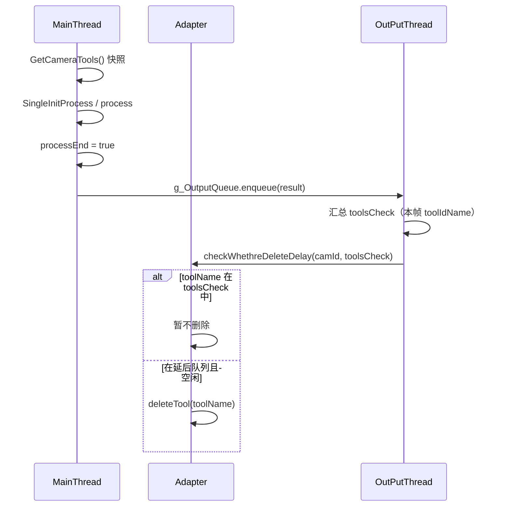
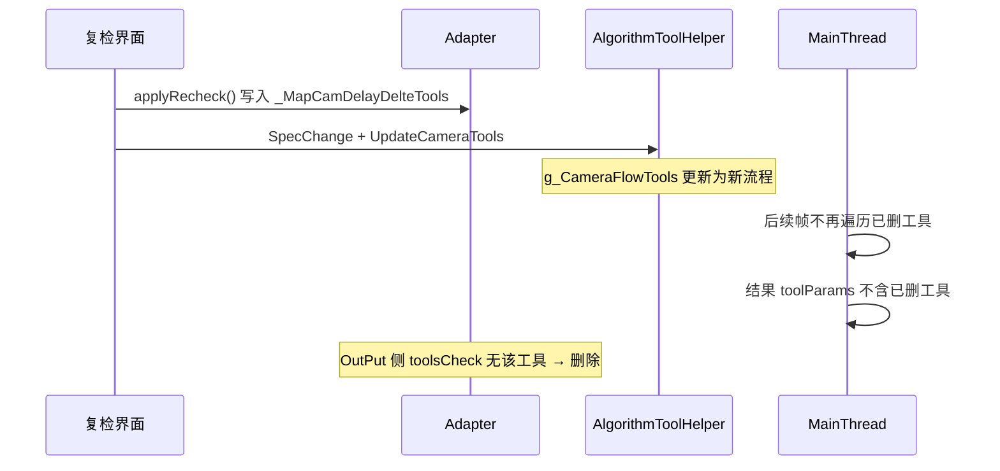

---
title: 算法工具指针与延后删除机制
categories:
- C++编程
tags:
- c++
- 多线程
- 生命周期
- 延迟回收
---

# 算法工具指针与延后删除机制 — 问题总结

> 文档整理自 `__mapName2Algs` / `g_CameraFlowTools` / 复检应用 / `OutPutThread` 延后删除相关讨论。  
> 涉及文件：`Adapter`、`AlgorithmToolHelper`、`MainThread`、`FlowThread`、`OutPutThread`。

---

## 1. 背景与核心数据结构

### 1.1 两套「工具视图」

| 数据源 | 位置 | 用途 |
|--------|------|------|
| `Adapter::__mapName2Algs` | Adapter | 工具实例的权威存储（`BaseTool*` 生命周期由 Adapter 管理） |
| `AlgorithmToolHelper::g_CameraFlowTools` | AlgorithmToolHelper | 在线检测用的流程/工具配置（含 `AlgToolParam.AlgoImpl` 缓存指针） |

检测线程每帧通过 `GetCameraTools(cameraIndex)` 取得 **值拷贝** 的快照，在 `SingleInitProcess` 中使用其中的 `AlgoImpl` 执行 `initialize` / `process`。

### 1.2 相关 API

```cpp
// adapter.h / adapter.cpp
QMap<QString, BaseTool*>* getAlgMap();           // 持锁返回内部 map 指针，锁在函数返回后释放
QMap<QString, BaseTool*>  getAlgMapCopy();      // 持锁拷贝 map（浅拷贝指针）
BaseTool* getTool(QString);                     // 不存在则创建
BaseTool* peekTool(QString, bool recheck);      // 仅查询，不存在返回 nullptr（建议检测路径使用）
void checkWhethreDeleteDelay(int nCamID, QVector<QString> toolsCheck);  // 按本帧执行结果决定是否删除
void deleteCamDelayTool(int nCamID);            // 旧路径，当前实现开头直接 return
```

---

## 2. 堆损坏 / UAF 的典型原因（与 map 容器本身无关）

问题往往不在 `QMap` 结构，而在 **`BaseTool*` 生命周期与多线程访问不同步**。

### 2.1 `getAlgMap()` 的设计缺陷

```cpp
QMap<QString, BaseTool*>* Adapter::getAlgMap()
{
    QMutexLocker lockerMap(&mutexAlgMap);
    return &__mapName2Algs;  // 锁在 return 后释放
}
```

调用方若在锁外遍历 `getAlgMap()->values()`，会与 `deleteTool`、`applySpec`、`freeLastSpecTool` 等并发修改 map，产生未定义行为。

**建议**：对外只暴露 `getAlgMapCopy()`，或提供 `withAlgMap(callback)` 在锁内完成操作；`setLogLevel` / `updateLogLevel` 等应在 `mutexAlgMap` 下直接遍历 `__mapName2Algs`。

### 2.2 快照指针 ≠ 长期有效

`getAlgMapCopy()` 或 `GetCameraTools()` 只保证拷贝那一刻 map/配置一致，**不保证** 拷贝里的 `BaseTool*` 之后仍有效：

- 线程 A：`deleteTool` / `freeLastSpecTool` 释放对象  
- 线程 B：仍使用旧快照中的 `AlgoImpl` → **use-after-free**

**另一线程把局部变量置 `nullptr` 不会**让其他线程快照里的地址自动变空；快照里仍是旧地址（多为悬空指针，且常 `!= nullptr`）。

### 2.3 规格切换时序（`applySpec` + `freeLastSpecTool`）

```text
applySpec  → __tempMapName2Algs = __mapName2Algs; __mapName2Algs.clear(); 加载新规格
... 各模块刷新 ...
freeLastSpecTool() → delete 旧 __tempMapName2Algs 中的 BaseTool*
```

若检测线程仍持有切换前的 `AlgoImpl` / `mAlgMap` 快照，可能在 `freeLastSpecTool` 之后继续访问 → UAF。  
规格切换应保证：**停检或等 `processEnd` → 刷新工具表 → 再释放旧实例**。

### 2.4 `AlgorithmToolHelper` 与 Adapter 联动

- `deleteAlgorithmImpl` 等若 **先 `deleteTool` 再从 `g_CameraFlowTools` 移除**，存在短暂窗口：map 中已无工具，但其他线程快照仍含 `AlgoImpl`。  
- **建议删除顺序**：先在 `getToolMute` 下从 `g_CameraFlowTools` 移除，再调用 `deleteTool`。  
- 所有读写 `g_CameraFlowTools` / `copyCameraFlowTools` 的路径应统一使用 `getToolMute`（与 `GetCameraTools` 一致）。

### 2.5 检测路径应用前校验（推荐）

在 `MainThread` / `FlowThread` 每次 `process` / `initialize` 前：

```cpp
BaseTool* toolImpl = Adapter::getInstance()->peekTool(algtool.idName, isOffline);
if (nullptr == toolImpl || !toolImpl->bUse) continue;
// 全程使用 toolImpl，勿用快照里可能过期的 algtool.AlgoImpl
```

---

## 3. 复检「应用参数」与延后删除

### 3.1 `applyRecheck()` 做什么

用户于复检界面编辑流程（增删工具）后点击「应用参数」：

1. `Adapter::applyRecheck()`  
   - 将复检工具参数同步到真实相机工具  
   - 复检中删除的真实相机工具名写入 `_MapCamDelayDelteTools[nLastRecheckCam]`（**不立即 `deleteTool`**）  
   - 清理复检临时工具等  

2. `QtAlgoAdjust::ApplyParam()` → `ApplyTabChange` → `setApplyParam()` → `SpecChange(..., modelType=2)`  
   - 从磁盘重载流程，`initAlgorithmImpl` → `copyCameraFlowTools`  
   - `UpdateCameraTools(m_cameraIndex)` 更新在线 `g_CameraFlowTools`（**新流程中已无被删工具**）

### 3.2 复检里「删除工具」与「应用参数」的区别

| 阶段 | 在线 `__mapName2Algs` | 在线检测配置 |
|------|------------------------|--------------|
| 复检界面仅删除节点（未应用） | 通常仍在 | 仍为旧流程，检测仍可能跑到该工具 |
| 点击应用参数之后 | 进入延后删除队列 | 新流程不含该工具，检测不再遍历 |

设计意图：**应用参数后，在线结果不应再包含已删工具；确认无执行记录后再物理删除。**

---

## 4. 延后删除的两种实现

### 4.1 旧方案：`QTimer::singleShot(1000)` + `deleteCamDelayTool`

位置：`AlgorithmToolHelper::UpdateCameraTools`、`ApplyCameraAlg` 等。

问题：

- 以 **固定 1 秒** 为条件，与「本帧是否仍执行该工具」无关  
- 与 `MainThread` / `OutPutThread` 异步，无法表达「检测已结束」  
- 当前 `deleteCamDelayTool()` 在函数开头 **`return`**，定时器实际为空操作，但代码仍存在，易误导  

### 4.2 现方案：`OutPutThread` + `checkWhethreDeleteDelay`（推荐主路径）

**位置**：`OutPutThread::run()`，在线相机分支（非复检相机 `bRecheck`）

```cpp
QVector<QString> toolsCheck;
for (auto& flow : t_OutputInfo.algFlowParams)
    for (auto& tool : flow.toolParams)
        toolsCheck.push_back(tool.toolIdName);

Adapter::getInstance()->checkWhethreDeleteDelay(t_OutputInfo.cameraIndex + 1, toolsCheck);
```

**逻辑**（`adapter.cpp`）：

- 若 `_MapCamDelayDelteTools` 中某 `toolName` **出现在** `toolsCheck` → 本帧结果仍反映该工具被执行 → **暂不删除**  
- 若 **未出现** 且工具非 `getInitStatus` / `getDetectStatus` → `deleteTool(toolName)`  
- 复检相机线程（`cameraIndex == nCameraNum`）**不进入**此分支，避免误删  

**`toolsCheck` 的来源**：仅包含本帧 `SingleInitProcess` 中实际 `process` 并写入 `ResultAlgFlowParam.toolParams` 的工具（`toolIdName == algtool.idName`）。  
未启用（`!bUse`）、排废提前退出未跑到的工具不会进入 `toolsCheck`。

### 4.3 为何该方案优于定时器

```text
应用复检 → 刷新 g_CameraFlowTools（新流程无工具 X）
    ↓
MainThread：不再遍历 X → 结果无 X.toolIdName
    ↓
OutPutThread：toolsCheck 不含 X → checkWhethreDeleteDelay 删除 X
```

与业务语义一致：**「输出结果不再带该工具信息 → 才滞后删除」**，而不是「应用后 1 秒」。

### 4.4 与「隐患：下一帧仍用旧快照」的澄清

曾讨论的过渡竞态（仅当 **应用复检与「已用旧快照开跑的某一帧」并行** 时）：

```text
T1  帧 A 开始：GetCameraTools() 仍含工具 X（应用前快照）
T2  用户应用复检：流程已刷新，g_CameraFlowTools 无 X
T3  帧 A 仍在 SingleInitProcess 中使用 X.AlgoImpl
T4  OutPut 处理更早/其他队列项，toolsCheck 无 X → deleteTool(X)
T5  帧 A 继续 X->process() → 可能 UAF
```

在以下前提下，该竞态 **可不作为常态风险**：

- 应用复检前在线检测已停止，或  
- 该相机无在途 `SingleInitProcess`（`processEnd` 且旧帧已结束）  

**稳态路径**（应用后新流程跑起来）：新帧 `GetCameraTools` 不含 X → 不会 `process` X → 输出永不含 X → 安全删除。  
这与「输出不带才删」**不矛盾**；若产线保证停检后再应用，可认为主场景成立。

---

## 5. 时序简图

### 5.1 单帧检测与 OutPut 删除（在线相机）



### 5.2 复检应用参数



---

## 6. 实现层面待完善项（非否定现方案）

| 项 | 说明 |
|----|------|
| `_MapCamDelayDelteTools` 维护 | `checkWhethreDeleteDelay` 删除成功后未从列表移除，会重复扫描（一般无害） |
| `deleteCamDelayTool` | 已 `return`，与 `UpdateCameraTools` 中 `QTimer` 建议一并清理，避免双路径复活 |
| `retryTools` | `checkWhethreDeleteDelay` 中声明未使用；`bDetecting` 为真时跳过，依赖后续某帧输出仍无该工具时再删 |
| `ApplyParam` 闸门 | 进入复检仅 `readyCheck`；应用参数未统一等待 `processEnd` / 停检（若需彻底封死过渡竞态可加） |
| `peekTool` | 建议在检测入口统一解析指针；`peekTool` 若被注释需恢复 |
| `toolsCheckLast` | `OutPutThread` 成员仅赋值未读，可删或用于诊断 |

---

## 7. 建议实践清单

### 7.1 删除与并发

- [ ] 延后删除以 **`checkWhethreDeleteDelay` + 本帧 `toolsCheck`** 为主路径  
- [ ] 移除或注释干净的 **`QTimer` + `deleteCamDelayTool`** 备用路径  
- [ ] `deleteAlgorithmImpl`：**先从 `g_CameraFlowTools` 移除，再 `deleteTool`**  
- [ ] `g_CameraFlowTools` 全部访问加 **`getToolMute`**  

### 7.2 检测线程

- [ ] `process` / `initialize` 前 **`peekTool(idName)`**，无效则 `continue`  
- [ ] 避免无锁使用 `getAlgMap()` 返回的裸指针  

### 7.3 规格 / 复检切换

- [ ] 规格切换：`freeLastSpecTool` 前确保无在途检测（`processEnd` + 停检）  
- [ ] 应用复检：若需绝对安全，应用前 **`!runnings[cam] && processEnd[cam]`**  

### 7.4 诊断

- [ ] 删除时打日志：`camId`、`toolName`、是否在 `toolsCheck`（已有部分 `XInfo` / `XWarning`）  

---

## 8. 结论

1. **堆损坏** 主要来自 **`BaseTool*` 悬空使用**，而非 `QMap` 单独线程不安全。  
2. **`getAlgMapCopy` / 快照 `AlgoImpl`** 不能代替生命周期管理；检测应用前应 **`peekTool`** 或等价校验。  
3. **复检延后删除** 用 **`OutPutThread` + 本帧 `toolIdName` 集合** 判断，符合「结果中不再出现才删除」，优于固定延时。  
4. **正常路径**（应用复检 → 新流程 → 检测不再跑该工具 → 输出无该工具 → 删除）在设计与实现上一致；过渡重叠仅在与旧快照并行时需额外停检约束。  

---

## 9. 关键代码索引

| 主题 | 文件 | 约略位置 |
|------|------|----------|
| 延后删除检查 | `OutPutThread.cpp` | `run()` 在线分支，`toolsCheck` |
| `checkWhethreDeleteDelay` | `adapter.cpp` | ~2969 |
| `applyRecheck` / 延后队列 | `adapter.cpp` | ~2669, ~2813 |
| `deleteCamDelayTool`（已禁用） | `adapter.cpp` | ~2912 |
| `UpdateCameraTools` + Timer | `AlgorithmToolHelper.cpp` | ~32 |
| 单帧检测 | `MainThread.cpp` | `run()`, `SingleInitProcess` |
| 应用复检 UI | `QtAlgoAdjust.cpp` | `ApplyParam`, `SpecChange` |

---

*文档版本：2026-05-21*
